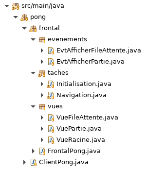

# Tutoriel 4.3: graphe de tâches hiérarchique

## Transformer `Initialisation` en groupe de tâches

1. Dans `Initialisation`, je m'assure d'avoir

    $[java ./Initialisation01]()

1. Je transforme ce code pour avoir

    $[java ./Initialisation02]()

    * **ATTENTION** je m'assure d'utiliser `subTasks` dans les appels de méthode
        * p.ex. `afficherFenetre(subTasks)`

## Créer le groupe de tâches `Navigation`

1. Dans le paquet `taches`, je crée la classe `Navigation`

1. J'ajoute le `import static`
    
    *  `import static ca.ntro.app.tasks.frontend.FrontendTasks.*;` 

1. J'ajoute la méthode `creerTaches` 

    $[java ./Navigation01]()

    * **ATTENTION** je m'assure d'avoir le `waitsFor`

1. Je m'assure d'avoir l'arborescence suivante dans mon projet:

## Appeler `Navigation.creerTaches` dans le Frontal

1. J'ouvre `FontalPong` et j'ajoute l'appel à `Navigation.creerTaches`

    $[java ./FrontalPong]()
