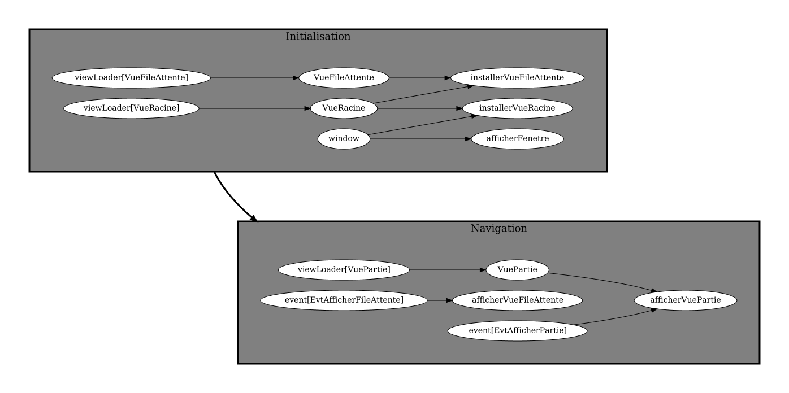

# Tutoriel 4.5: tester que tout fonctionne

## Exécuter le client

1. J'exécute le client

        $ cd tutoriels
        $ sh gradlew client

1. Au besoin je corrige les erreurs

## Vérifier le comportement

1. Je m'assure de pouvoir changer de page

    

    <video width="50%" src="tut04.mp4" type="video/mp4" loop nocontrols autoplay>
    

## Vérifier le graphe de tâches

1. Je m'assure d'avoir le graphe de tâches suivant:

    

        
    

    * NOTES:
        * le graphe est généré, alors l'emplacement exact des noeuds peut varier
        * l'important est d'avoir les mêmes séquences
            * p.ex. `viewLoader[VuePartie]` → `VuePartie` → `afficherVuePartie`
