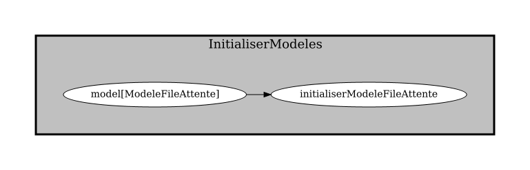
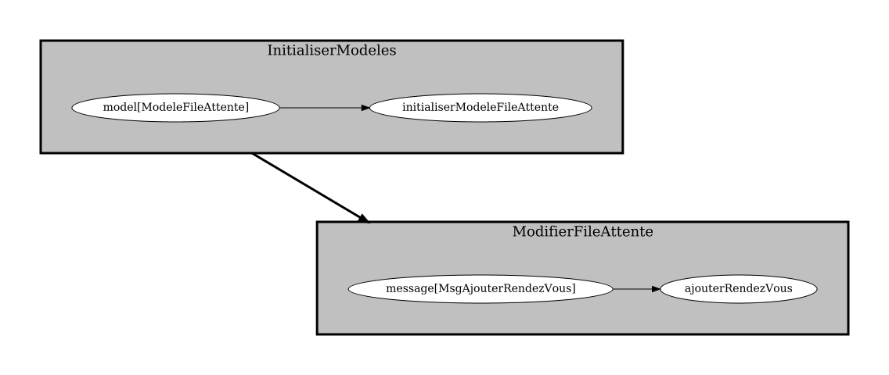

# Théorie: créer un dorsal

<video width="50%" src="dorsal01.mp4" type="video/mp4" controls>

1. Notre client doit **obligatoirement** déclarer un dorsal

1. Si le dorsal est dans le client, on va déclarer un dorsal *local*

1. Si le dorsal s'exécute sur le serveur, on va déclarer un dorsal *distant*

## Créer un dorsal *local*

<video width="50%" src="local01.mp4" type="video/mp4" controls>

1. Un dorsal local hérite de `LocalBackendNtro`

$[java ./DorsalPong01 1 1]()

1. Un dorsal local doit déclarer des tâches

$[java ./DorsalPong01]()

1. On utilise un `BackendTasks` pour créer les tâches du dorsal

    * ce n'est pas le même genre de tâches qu'un frontal

1. On va aussi faire un `import static` différent

    *  `import static ca.ntro.app.tasks.backend.BackendTasks.*;` 

## Créer un dorsal *distant*

<video width="50%" src="distant01.mp4" type="video/mp4" controls>

1. Un dorsal distant hérite de `RemoteBackendNtro`

$[java ./DorsalPong02 1 1]()

1. Un dorsal distant doit déclarer un serveur auquel se connecter

$[java ./DorsalPong02]()

1. Le client se connecte alors à un seveur où s'exécute le vrai dorsal

    * les modèles sont entroposés et modifiés sur le serveur

## Déclarer le dorsal

<video width="50%" src="declarer01.mp4" type="video/mp4" controls>

1. Qu'il soit local ou distant, le client doit déclarer le dorsal:

$[java ./ClientPong01]()

## Ajouter des tâches au dorsal

<video width="50%" src="taches01.mp4" type="video/mp4" controls>

1. Les tâches d'un dorsal sont typiquement plus simples que celles du frontal

1. Typiquement, le dorsal va soit

    * initialiser un modèle

    

        
    

    * recevoir un message et modifier un modèle

    

        
    

