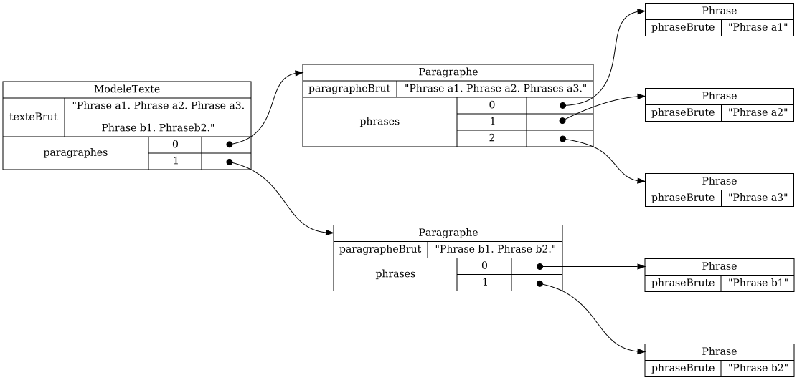

# Théorie: notion de modèle

## Le modèle contient les données d'une page

<video width="50%" src="modele01.mp4" type="video/mp4" controls>

1. Imaginons un `ModeleTexte` pour du texte structuré en paragraphes et en phrases

1. En `Ntro`, il s'agit d'une classe Java qui implante `Model`

    $[java ./ModeleTexte01 1 1]()

1. On doit déclarer chaque modèle dans le client:

    $[java ./ClientPong01]()

1. Les attributs de la classe déterminent les données à mémoriser dans le modèle

    $[java ./ModeleTexte01]()

## Le modèle contient des valeurs 

<video width="50%" src="valeur01.mp4" type="video/mp4" controls>

1. Une Valeur est un objet qui n'est pas une valeur de base comme `String` ou `int`

1. Pour notre exemple `ModeleTexte`, imaginons deux valeurs:
    * `Paragraphe`
    * `Phrase`

1. En `Ntro`, une valeur est une classe Java qui implante `Value`

    $[java ./Paragraphe01]()

    $[java ./Phrase01]()

1. On doit déclarer chaque valeur dans le client

    $[java ./ClientPong02]()

1. Le `ModeleTexte` peut maintenant mémoriser une liste de paragraphes

    $[java ./ModeleTexte02]()

1. Chaque `Paragraphe` peut mémoriser une liste de phrases

    $[java ./Paragraphe02]()

## Le modèle est formé d'un ou plusieurs objets

<video width="50%" src="modele02.mp4" type="video/mp4" controls>

1. Typiquement, un modèle contient plusieurs objets

    * un objet *principal* (le modèle comme tel)
    * des objets *secondaires*, qui représentent des valeurs contenu dans le modèle

    

## Le modèle est indépendant de la logique du programme

<video width="50%" src="modele03.mp4" type="video/mp4" controls>

1. Le modèle ne décide pas:
    * quand il est créé
    * où il est sauvegardé (fichier ou DB)
    * sur quelle vue il est affiché
    * après quel événement usager il doit être modifié

1. Les tâches ci-haut appartiennent au dorsal ou au frontal
    * (ou au Contrôleur du patron MVC)

## Le modèle implante la logique du domaine

<video width="50%" src="modele04.mp4" type="video/mp4" controls>

1. Le modèle décide:
    * quelles données mémoriser et afficher (mais pas *comment* les afficher)
    * comment modifier ces données

1. La logique du domaine est spécifique au type de données qu'on représente, p.ex.
    * jeu d'échecs
        * comment bouger les pièces
    * logiciel d'impôts
        * comment calculer le total des revenus imposables
    * traitement de texte
        * où appliquer les alinéas (indentation au début d'un paragraphe)

1. Dans notre exemple, on peut imaginer une méthode `genererHtml`

## Truc: déléguer aux valeurs

<video width="50%" src="modele05.mp4" type="video/mp4" controls>

1. La division du modèle en valeurs facilite l'implantation de `genererHtml`

    * le `ModeleTexte` délègue la génération de chaque paragraphe

    $[java ./ModeleTexte03]()

    * le `Paragraphe` délègue la génération de chaque phrase

    $[java ./Paragraphe03]()

    * la `Phrase` est simple à générer

    $[java ./Phrase02]()

1. Voici le résultat

    $[html ./genererHtml01]()

1. On peut aussi ajouter des retours de ligne `\n` et des indentations `\t`

    $[html ./genererHtml02]()
