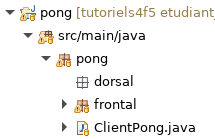
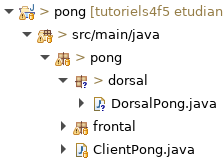

# Tutoriel 5.1: créer le dorsal

## Créer le paquet `dorsal`

1. Dans `pong`, je crée le paquet `dorsal`

1. Je m'assure d'avoir l'arborescence suivante dans mon projet:

    

    
    

1. J'observe que paquet `dorsal` va directement sous `pong`
    * le dorsal est un élément de l'application, au même niveau que le Frontal

## Créer la classe `DorsalPong`

1. Dans le paquet `dorsal`, je crée la classe `DorsalPong`

1. Je m'assure d'avoir l'arborescence suivante dans mon projet:

    

    
    

1. J'ajuste la signature de `DorsalPong` qui doit hériter de `LocalBackendNtro`

    $[java ./DorsalPong01 1 1]()

1. J'utiliser $[kbd](Ctrl+1) pour ajouter les `import` et créer les méthodes obligatoires

1. Je m'assure d'avoir les méthodes suivantes

    $[java ./DorsalPong01]()

1. J'observe que dans le Dorsal, la méthode `createTasks` reçoit un `BackendTasks`
    * (et non un `FrontendTasks`)
    * Dans un dorsal, on va créer des tâches spécifiques à un dorsal

## Déclarer le dorsal dans `ClientPong`

1. J'ouvre `ClientPong` et j'ajoute le code pour déclarer le dorsal

    $[java ./ClientPong01]()

1. Au besoin, je corrige les erreurs de compilation
