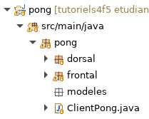
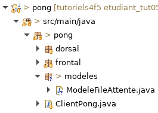
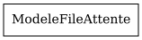
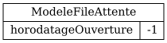

# Tutoriel 5.2: créer le `ModeleFileAttente`

## Créer le paquet `modeles`

1. Dans `pong`, je crée le paquet `modeles`

1. Je m'assure d'avoir l'arborescence suivante dans mon projet:

    

    
    

1. J'observe que `modeles` va directement sous `pong`
    * (et non dans `frontal` ou `dorsal`)
    * les modèles sont partagés par le Dorsal et le Frontal

## Créer la classe `ModeleFileAttente`

1. Dans le paquet `modeles`, je crée la classe `ModeleFileAttente`

1. J'ajuste la signature de `ModeleFileAttente` qui doit implanter `Model`

    $[java ./ModeleFileAttente01]()

1. Au besoin, je corrige les erreurs de compilation

1. Je m'assure d'avoir l'arborescence suivante dans mon projet:

    

    
    

## Ajouter un constructeur par défaut

1. Avant d'oublier, j'ajoute un constructeur par défaut au `ModeleFileAttente`

    $[java ./ModeleFileAttente02]()

    * NOTES: 
        * le constructeur par défaut est **obligatoire**
        * c'est nécessaire afin de créer un objet Java à partir d'un fichier `.json`

## Déclarer le modèle dans `ClientPong`

1. J'ouvre `ClientPong` et j'ajoute le code pour déclarer le modèle

    $[java ./ClientPong01]()

1. Au besoin, je corrige les erreurs de compilation

## Exécuter le client avec un modèle

1. J'exécute le client

        $ cd tutoriels
        $ sh gradlew client

1. J'observe que `Ntro` a créé le fichier `.json` suivant

    <pre>
            pong/_storage/modeles/ModeleFileAttente.json
    </pre>

1. J'ouvre le fichier:

    $[json ./ModeleFileAttente01]()

    * NOTES: 
        * pour l'instant notre modèle est un objet vide
        * l'attribut `_C` est ajouté automatiquement par `Ntro` pour indiquer la classe

1. Je quitte le client `pong`

1. J'observe que `Ntro` a créé le graphe suivant

    <pre>
            pong/_storage/graphs/ModeleFileAttente.png
    </pre>

1. J'affiche `ModeleFileAttente.png`

    

        
    

    * NOTES:
        * il s'agit d'une visualisation du modèle
        * pour l'instant c'est un objet vide de type `ModeleFileAttente`

    

## Ajouter un attribut au modèle

1. J'ajoute l'attribut `horodatageOuverture` au modèle

    $[java ./ModeleFileAttente03]()

    * NOTES:
        * cet attribut indique le moment où la file d'attente a été ouverte
        * on va l'initialiser plus tard

1. Je supprime la version sauvgardée du modèle

        $ cd tutoriels
        $ rm pong/_storage/models/ModeleFileAttente.json

    * NOTES:
        * `Ntro` utilise toujours la version sauvegardée lorsqu'elle existe
        * pour générer un nouveau modèle, il faut la supprimer 

1. J'exécute le client `pong` afin de générer `ModeleFileAttente.json`

        $ cd tutoriels
        $ sh gradlew client

1. J'ouvre le fichier `ModeleFileAttente.json`

    $[json ./ModeleFileAttente02]

1. J'observe que le modèle est encore vide

    * il faut des méthodes *get/set* pour que l'attribut existe en `.json`

1. Je quitte le client `pong` afin de générer `ModeleFileAttente.png`

1. J'observe qu'encore une fois l'objet `ModeleFileAttente` est vide:

    

        
    

## Ajouter les accesseurs (les méthodes *get* et *set*)

1. Je génère les accesseurs avec $[kbd](Shift+Alt+S) => *Generate Setters and Getters*

    $[java ./ModeleFileAttente04]()

1. Je supprime la version sauvgardée du modèle

        $ cd tutoriels
        $ rm pong/_storage/models/ModeleFileAttente.json

1. J'exécute le client `pong` afin de générer `ModeleFileAttente.json`

        $ cd tutoriels
        $ sh gradlew client

1. J'ouvre le fichier `ModeleFileAttente.json`

    $[json ./ModeleFileAttente03]

1. J'observe que cette fois le `.json` contient maintenant l'attribut `horodatageOuverture`

1. Je quitte le client `pong` afin de générer `ModeleFileAttente.png`

1. J'observe que cette fois l'objet `ModeleFileAttente` contient `idFileAttente`

    

        
    

    * NOTES:
        * on va initialiser `horodatageOuverture` dans une tâche du dorsal

        

