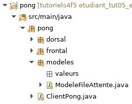
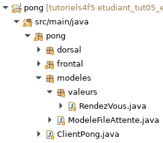
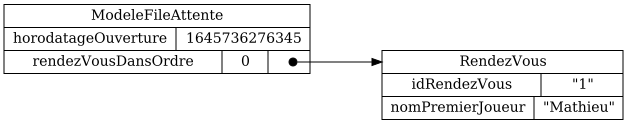

# Tutoriel 5.4: ajouter la liste de rendez-vous

## Créer le paquet `valeurs`

1. Dans `modeles`, je crée le paquet `valeurs`

1. Je m'assure d'avoir l'arborescence suivante dans mon projet:

    

    
    

## Créer la valeur `RendezVous`

1. Dans le paquet `valeurs`, je crée la classe `RendezVous`

1. Je m'assure d'avoir l'arborescence suivante dans mon projet:

    

    
    

1. J'ajuste la signature de `RendezVous` qui doit implanter `Value`

    $[java ./RendezVous01]()

1. Au besoin, je corrige les erreurs de compilation

    * **ATTENTION** je dois importer la version de `ca.ntro.app.models`

1. J'ajoute le constructeur par défaut de `RendezVous`

    $[java ./RendezVous02]()

1. J'ajoute les attributs d'un rendez-vous

    $[java ./RendezVous03]()

1. Je génère les accesseurs avec $[kbd](Shift+Alt+S) => *Generate Setters and Getters*

    $[java ./RendezVous04]()

1. Je déclare la valeur `RendezVous` dans le client:

    $[java ./ClientPong01]

1. Au besoin, je corrige les erreurs de compilation

## Ajouter la liste `rendezVousDansOrdre`

1. Dans `ModeleFileAttente`, j'ajoute la liste de rendez-vous

    $[java ./ModeleFileAttente04]()

1. Au besoin, je corrige les erreurs de compilation

    * Je m'assure d'importer `java.util.List`

1. Je génère les accesseurs avec $[kbd](Shift+Alt+S) => *Generate Setters and Getters*

    $[java ./ModeleFileAttente05]()

1. Je supprime la version sauvgardée du modèle

        $ cd tutoriels
        $ rm pong/_storage/models/ModeleFileAttente.json

1. J'exécute le client `pong` afin de générer `ModeleFileAttente.json`

        $ cd tutoriels
        $ sh gradlew client

1. J'ouvre le fichier `ModeleFileAttente.json`

    $[json ./ModeleFileAttente03]

1. J'observe que le `.json` contient maitenant `rendezVousDansOrdre`

## Ajouter un `RendezVous` dans le fichier `.json`

1. J'ouvre le fichier `ModeleFileAttente.json`

1. J'ajoute *à la main* un rendez-vous

    $[json ./ModeleFileAttente04]

1. J'exécute le client `pong`

        $ cd tutoriels
        $ sh gradlew client

1. Je quitte le client `pong` afin de générer `ModeleFileAttente.png`

1. J'observe que le modèle pour la file d'attente contient maitenant deux objets:

    

        
    

