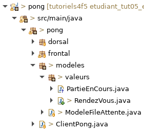
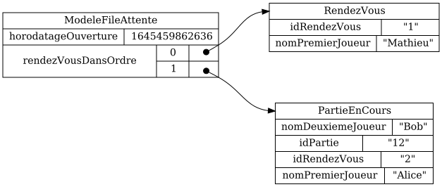

# Tutoriel 5.5: ajouter la valeur `PartieEnCours`

## Créer la valeur `PartieEnCours`

1. Dans le paquet `valeurs`, je crée la classe `PartieEnCours`

1. Je m'assure d'avoir l'arborescence suivante dans mon projet:

    

    
    

1. J'ajuste la signature de `PartieEnCours`, qui hérite de `RendezVous`

    $[java ./PartieEnCours01 1 1]()

1. J'ajoute le constructeur par défaut de `RendezVous`

    $[java ./PartieEnCours01]()

1. J'ajoute les attributs d'une partie en cours

    $[java ./PartieEnCours02]()

    * NOTE: par héritage, on a déjà les attributs d'un `RendezVous`

1. Je génère les accesseurs avec $[kbd](Shift+Alt+S) => *Generate Setters and Getters*

    $[java ./PartieEnCours03]()

1. Je déclare la valeur `RendezVous` dans le client:

    $[java ./ClientPong01]

1. Au besoin, je corrige les erreurs de compilation

## Ajouter une `PartieEnCours` dans le fichier `.json`

1. J'ouvre le fichier `ModeleFileAttente.json`

1. J'ajoute *à la main* une partie en cours

    $[json ./ModeleFileAttente01]

    * RAPPEL: par héritage, une `PartieEnCours` a aussi les attributs d'un `RendezVous`

1. J'exécute le client `pong`

        $ cd tutoriels
        $ sh gradlew client

1. Je quitte le client `pong` afin de générer `ModeleFileAttente.png`

1. J'observe que le modèle pour la file d'attente contient maitenant trois objets:

    

        
    

