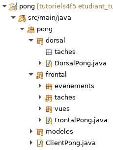
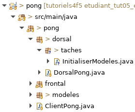

# Tutoriel 5.3: Initialiser le `ModeleFileAttente`

## Créer la méthode `ModeleFileAttente.initialiser()`

1. J'ouvre `ModeleFileAttente` et j'ajoute cette méthode

    $[java ./ModeleFileAttente01]()

1. Au besoin, je corrige les erreurs de compilation

## Créer le paquet `dorsal.taches`

1. Dans `dorsal`, je crée le paquet `taches`

1. Je m'assure d'avoir l'arborescence suivante dans mon projet:

    

    
    

1. J'observe qu'il y deux paquets `taches`
    * `dorsal.taches` pour les taches spécifiques au Dorsal
    * `frontal.taches` pour les taches spécifiques au Frontal

## Créer la classe `InitialiserModeles`

1. Dans le paquet `dorsal.taches`, je crée la classe `InitialiserModeles`

1. Je m'assure d'avoir l'arborescence suivante dans mon projet:

    

    
    

## Ajouter le `import static` spécifique au dorsal

1. J'ajoute le `import static` suivant

    *  `import static ca.ntro.app.tasks.backend.BackendTasks.*;` 

 

## Créer le groupe de tâches `InitialiserModeles`

1. Je crée une méthode `creerTaches` et un groupe de tâches

    $[java ./InitialiserModeles01]()

## Créer la tâche `initialiserModeleFileAttente`

1. Je crée une méthode et une tâche `initialiserModeleFileAttente`

    $[java ./InitialiserModeles02]

1. J'appelle ma méthode avec `subTasks`

    $[java ./InitialiserModeles03]

## Dans le dorsal, appeller `InitialiserModeles.creerTaches`

1. J'ouvre `DorsalPong` et j'ajoute l'appel

    $[java ./DorsalPong01]()

## Vérifier l'initilisation du modèle

1. J'exécute le client `pong` pour générer `ModeleFileAttente.json`

        $ cd tutoriels
        $ sh gradlew client

1. Je vérifie que `ModeleFileAttente.json` ressemble à:

    $[json ./ModeleFileAttente01]()

    * NOTE: visiter https://www.epochconverter.com/ pour décoder l'horodatage

1. Je quitte le client `pong` afin de générer `backend.png`

1. Je vérifie le graphe `pong/_storage/graphs/backend.png` ressemble à

    

