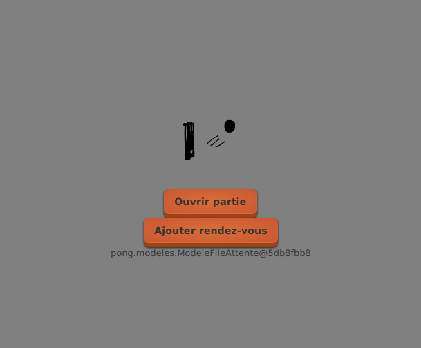
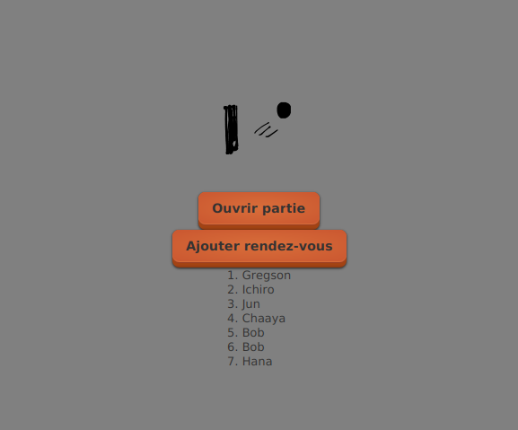

# Tutoriel 7.7: afficher en mode texte

1. Intuitivement, j'ajouterais

    $[java ./Intuitivement01]()

    * NOTE:
        * comme il y a un appel à *get*, on peut inverser le dépendance

1. En inversant, j'ajoute plutôt `ModeleFileAttente.afficherSur`

    $[java ./ModeleFileAttente01]()

    * NOTE:
        * maintenant il n'y a pas d'appel à *get*
        * plutôt, le modèle génère une chaîne à afficher via `toString`

1. Je dois ajouter `VueFileAttente.afficherMessage`

    $[java ./VueFileAttente01]()

1. Dans la tâche `afficherFileAttente`, j'ajoute l'appel à `afficherSur`

    $[java ./AfficherFileAttente01]()

1. Je peux déjà vérifier que ça fonctionne

        $ cd tutoriels
        $ sh gradlew client

    

        
    

1. Il me reste à définir `ModeleFileAttente.toString` correctement

    $[java ./ModeleFileAttente02]()

1. Ce qui veut dire définir `RendezVous.toString` correctement

    $[java ./RendezVous01]()

1. Et définir `PartieEnCours.toString` correctement

    $[java ./PartieEnCours01]()

1. Je devrais maintenant avoir l'affichage complet

        $ cd tutoriels
        $ sh gradlew client

    

        
    

1. Je peux aussi vérifier en modifiant le fichier `ModeleFileAttente.json`

    
        
    

    <video width="100%" src="tut07.mp4" type="video/mp4" loop nocontrols autoplay>
    

