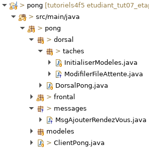

# Tutoriel 7.3: modifier le modèle dans le dorsal

1. Dans `dorsal.taches` j'ajoute la classe `ModifierFileAttente`

1. En Eclipse, je m'assure d'avoir l'arborescence suivante

    

        
    

1. J'ouvre `ModifierFileAttente` et j'ajoute le `import static` suivant:

    *  `import static ca.ntro.app.tasks.backend.BackendTasks.*;` 

1. Dans `ModifierFileAttente`, j'ajoute un groupe de tâches

    $[java ./ModifierFileAttente01]()

    * NOTE:
        * le groupe de tâche au complet attend que le modèle soit chargé

1. J'ajoute la tâche `ajouterRendezVous`

    $[java ./ModifierFileAttente02]()

    * NOTES:
        * la tâche reçoit le message
        * la tâche récupère le modèle

1. Dans `DorsalPong`, j'appelle `ModifierFileAttente.creerTaches`

    $[java ./DorsalPong01]()

1. J'exécute le client et je vérifie mon graphe de tâche pour le Dorsal

        $ cd tutoriels
        $ sh gradlew client

    

        
    

