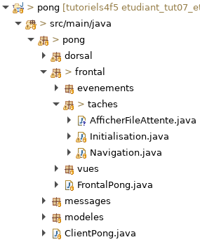
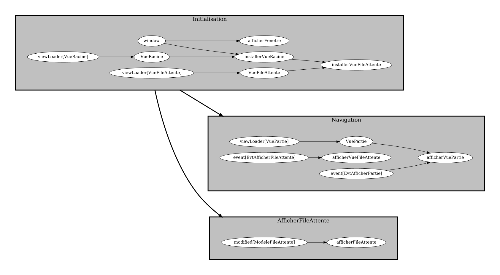

# Tutoriel 7.5: observer le modèle dans le frontal

1. Dans `frontal.taches` j'ajoute la classe `AfficherFileAttente`

1. En Eclipse, je m'assure d'avoir l'arborescence suivante

    

        
    

1. J'ouvre `AfficherFileAttente` et j'ajoute le `import static` suivant:

    *  `import static ca.ntro.app.tasks.frontend.FrontendTasks.*;` 

1. Dans `AfficherFileAttente`, j'ajoute un groupe de tâches

    $[java ./AfficherFileAttente01]()

    * NOTE:
        * le groupe de tâche au complet attend que la `VueFileAttente` soit créée, ce qui se fait dans le groupe de tâches `Initialisation`
        * dans le cas de `VuePartie`, la vue est plutôt créée dans le groupe de tâche `Navigation`

1. J'ajoute la tâche `afficherFileAttente`

    $[java ./AfficherFileAttente02]()

    * NOTES:
        * la tâche récupère la vue
        * la tâche observe le modèle
        * cette tâche sera donc appelée à chaque fois que le modèle est modifié

1. Dans `FrontalPong`, j'appelle `AfficherFileAttente.creerTaches`

    $[java ./FrontalPong01]()

1. J'exécute le client et je vérifie mon graphe de tâches pour le Frontal

        $ cd tutoriels
        $ sh gradlew client

    

        
    

    * NOTE:
        * mon graphe de tâches pourrait être légérement différent
        * l'important est d'avoir les bons groupes et les bonnes dépendances

