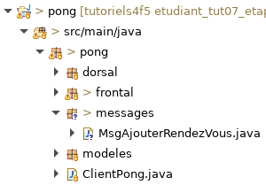

# Tutoriel 7.2: message `MsgAjouterRendezVous`

## Définir et déclarer le message

1. Dans le paquet `pong`, je crée le paquet `messages`

1. Dans le paquet `message`, je crée la classe `MsgAjouterRendezVous`

1. Dans Eclipse, je m'assure que l'arborescence de mon projet est comme suit

    

    
    

1. J'ajuste la signature de `MsgAjouterRendezVous` qui doit hériter de `MessageNtro`

    $[java ./MsgAjouterRendezVous01 1 1]()

1. J'ajoute l'attribut `nomPremierJoueur`

    $[java ./MsgAjouterRendezVous01 1 3]()

1. Je m'assure d'avoir un constructeur par défaut

    $[java ./MsgAjouterRendezVous01 1 6]()

1. Je génère les accesseurs avec $[kbd](Shift+Alt+S) => *Generate Setters and Getters*

    $[java ./MsgAjouterRendezVous01]()

1. Dans `ClientPong`, je déclare le message

    $[java ./ClientPong01]()

    * NOTES:
        * le message est déclaré dans le client
        * le message est partagé entre le frontal et le dorsal

1. Au besoin, je corrige les erreurs de compilation

## Créer et envoyer le message

1. Dans `VueFileAttente`, j'ajoute une méthode pour créer un message

    $[java ./VueFileAttente01]()

1. J'ajoute un capteur d'événement pour `boutonAjouterRendezVous`

    $[java ./VueFileAttente02]()

1. Pour chaque clic, je vais envoyé un nouveau message

    $[java ./VueFileAttente03]()

1. Finalement, je veux un nom pour chaque message envoyé

    $[java ./VueFileAttente04]()

    * NOTES:
        * pour l'instant, un nom choisi au hasard est suffisant 
        * on pourra plus tard utiliser le nom de l'usager courant

