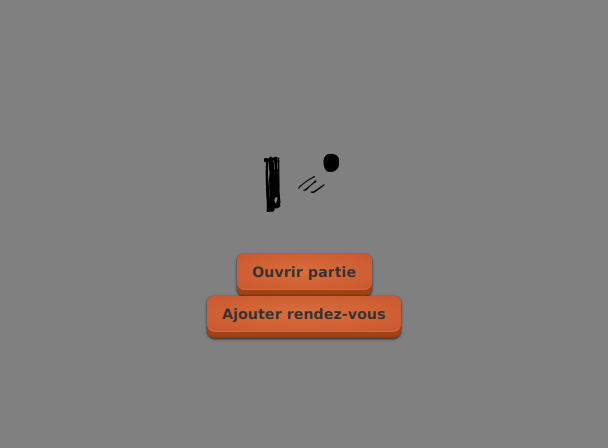

# Tutoriel 7.1: `boutonAjouterRendezVous`

1. J'ouvre `file_attente.xml` et j'ajoute le `boutonAjouterRendezVous`

    $[xml ./file_attente01]()

1. J'ouvre `chaines_fr.properties` et j'ajoute le texte

    <pre>
    ajouterRendezVous=Ajouter rendez-vous
    </pre>

1. J'ouvre `chaines_en.properties` et j'ajoute le texte

    <pre>
    ajouterRendezVous=Add appointment
    </pre>

1. J'ouvre `VueFileAttente` et j'ajoute l'attribut `boutonAjouterRendezVous`

    $[java ./VueFileAttente01]()

1. Je corrige les erreurs de compilation au besoin

1. En français, je devrais voir

        $ cd tutoriels
        $ sh gradlew clientFr

    

    
    

1. En anglais, je devrais voir

        $ cd tutoriels
        $ sh gradlew clientFr

    

    
    

