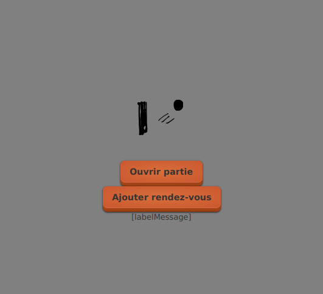

# Tutoriel 7.6: `boutonAjouterRendezVous`

1. J'ouvre `file_attente.xml` et j'ajoute le `labelMessage`

    $[xml ./file_attente01]()

1. J'ouvre `VueFileAttente` et j'ajoute l'attribut `labelMessage`

    $[java ./VueFileAttente01]()

1. Je corrige les erreurs de compilation au besoin

1. Pour l'instant, je devrais voir

        $ cd tutoriels
        $ sh gradlew client

    

    
    

