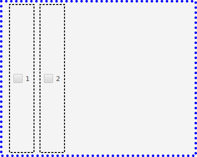
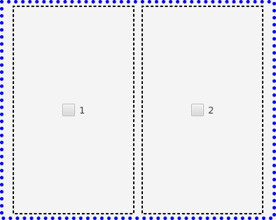
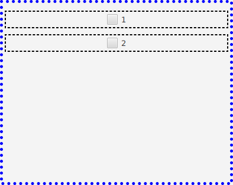
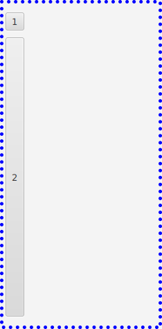
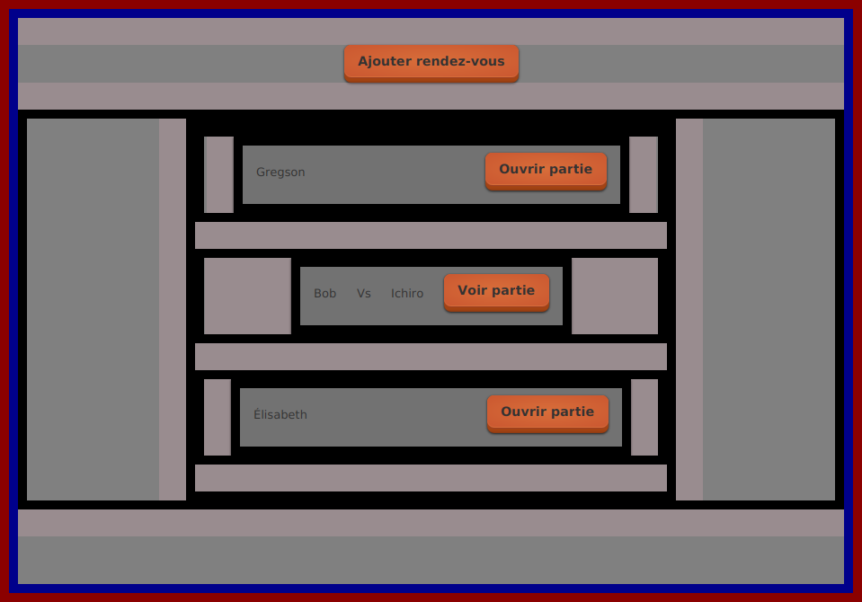
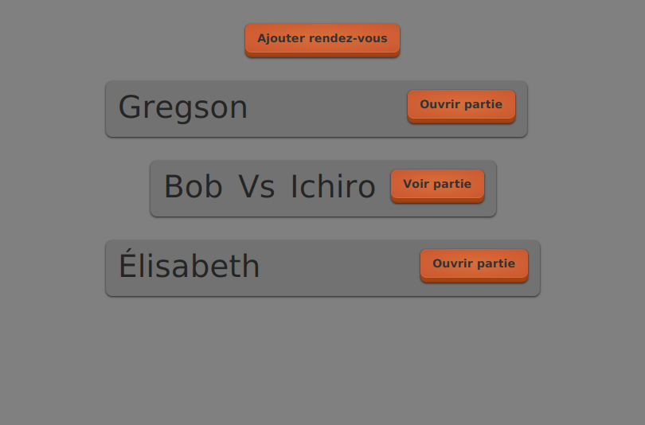
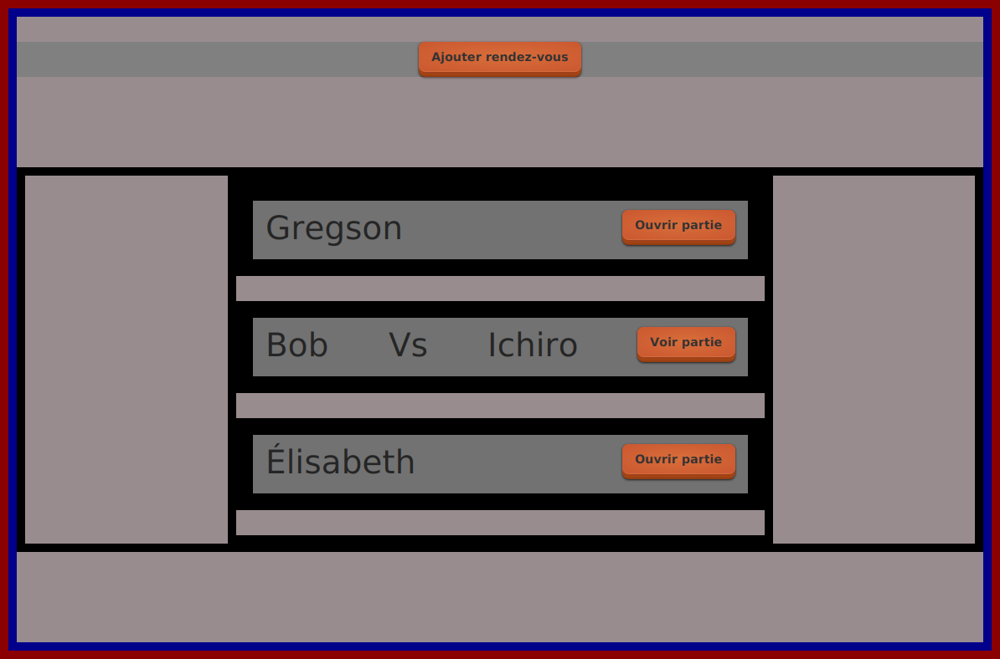
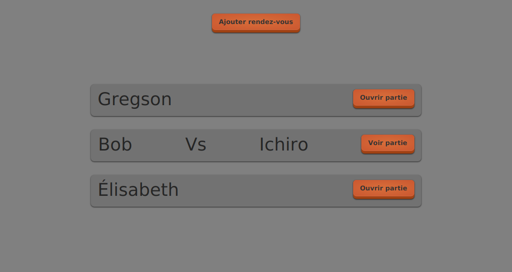

# JavaFX: tailles élastiques

## À l'intérieur d'un *HBox*

<video width="50%" src="hbox.mp4" type="video/mp4" controls>

1. Les conteneurs grandissent automatiquement en *hauteur*:

    

    
    

    $[xml ./vues03a]()

1. Pour qu'un conteneur grandisse en *largeur*, il faut ajouter `HBox.hgrow="ALWAYS"`

    

    
    

    $[xml ./vues03b]()

## À l'intérieur d'un *VBox*

<video width="50%" src="vbox.mp4" type="video/mp4" controls>

1. Les conteneurs grandissent automatiquement en *largeur*:

    

    
    

    $[xml ./vues03c]()

1. Pour qu'un conteneur grandisse en *hauteur*, il faut ajouter `VBox.vgrow="ALWAYS"`

    

    
    

    $[xml ./vues03d]()

## Attention: `HBox.hgrow` faire référence au parent

<video width="50%" src="parent_hbox.mp4" type="video/mp4" controls>

1. On peut appliquer à n'importe quel composant
1. La signification est: si je suis à l'intérieur d'un *HBox*, alors je grandis en largeur

    

    
    

    $[xml ./vues03e]()

## Attention: `VBox.vgrow` faire référence au parent

<video width="50%" src="parent_vbox.mp4" type="video/mp4" controls>

1. On peut appliquer à n'importe quel composant
1. La signification est: si je suis à l'intérieur d'un *VBox*, alors je grandis en hauteur

    

    
    

    $[xml ./vues03f]()

## Exemples du tutoriel 07

<video width="50%" src="exemples.mp4" type="video/mp4" controls>

1. Sans tailles élastiques

    

        
    

    

        
    

1. Avec tailles élastiques

    

        
    

    

        
    

1. En action

    <video width="100%" src="tut07_elastique.mp4" type="video/mp4" loop nocontrols autoplay>

    * NOTES:
        * les espaces élastiques se rapetissent
        * celui du haut reste le même (à cause de son `-fx-min-height`)
        * à la fin JavaFx est forcé de rapetisser l'espace du haut
            * car impossible de respecter tous les `fx-min-height`

