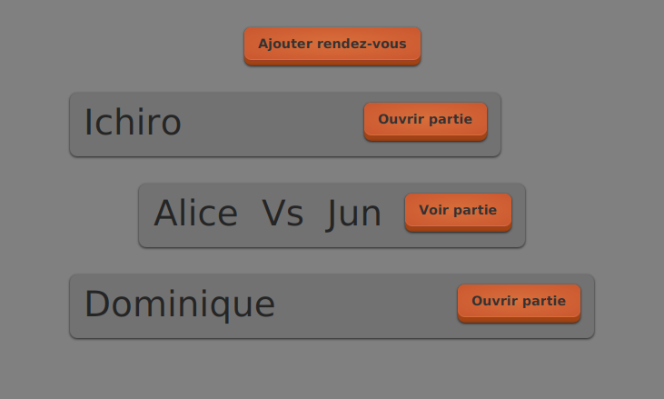

# Tutoriel 8.4: afficher les rendez-vous

## Afficher les rendez-vous dans `VueFileAttente`

1. J'ouvre `VueFileAttente` je j'ajoute ce code

    $[java ./VueFileAttente01]()

## Afficher les rendez-vous dans `ModeleFileAttente`

1. J'ouvre `VueFileAttente` je je complète le code de `afficherSur`

    $[java ./ModeleFileAttente02]()

1. J'utilise $[kbd](Ctrl+1) pour créer les méthodes suivantes:
    * `RendezVous.creerFragment`
    * `RendezVous.afficherSur`

1. J'observe que la méthode `ModeleFileAttente.afficherSur` fonctionne comme suit:
    * on itére chaque valeur `RendezVous`
    * on demande à la valeur de créer un fragment adéquat pour s'afficher
    * on demande à la valeur de s'afficher sur ce fragment
    * on demande à la vue d'ajouter ce fragment

## Compléter `RendezVous` et `PartieEnCours`

1. J'ouvre `RendezVous` et j'ajoute le code suivant:

    $[java ./RendezVous01]()

    * NOTES:
        * `creerFragment` ne fait que choisir et appeler le bon `ViewLoader` 

1. J'ouvre `PartieEnCours` et j'ajoute le code suivant:

    $[java ./PartieEnCours01]()

    * NOTES:
        * encore une fois, `creerFragment` ne fait que choisir et appeler le bon `ViewLoader` 
        * on utilise le fait que `FragmentPartieEnCours` hérite de `FragmentRendezVous` pour simplifier le code avec un appel à `super`

## Tester que ça fonctionne

1. J'exécute le client et je vérifie que le modèle s'affiche avec des éléments graphiques

        $ cd tutoriels
        $ sh gradlew client

    

        
    

    * NOTES:
        * on voit que les tailles ne sont pas encore élastiques

    

