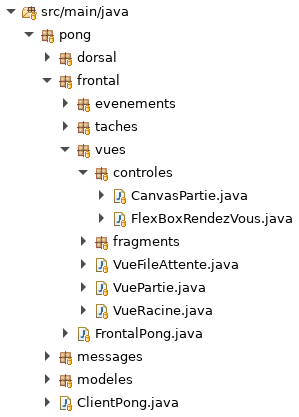

# Tutoriel 8.8: créer et utiliser le `CanvasPartie`

## Créer la classe `CanvasPartie`

1. Dans le paquet `vues.controles`, je crée la classe `CanvasPartie`

1. En Eclipse, je m'assure d'avoir l'arborescence suivante:

    

        
    

1. J'ouvre `CanvasPartie` et j'ajuste la signature:

    $[java ./CanvasPartie01]()

1. Avec $[kbd](Ctrl+1), j'ajoute le `import` et les méthodes obligatoires

    $[java ./CanvasPartie02]()

1. J'ajoute un dessin très simple

    $[java ./CanvasPartie03]()
 
## Utiliser le `CanvasPartie` dans le `.xml`

1. J'ouvre `partie.xml` et je modifie le FXML comme suit:

    $[xml ./partie]()

## Tester que ça fonctionne

1. J'exécute le client et je vérifie que mon dessin s'affiche

        $ cd tutoriels
        $ sh gradlew client

    <video width="100%" src="canvas.mp4" type="video/mp4" loop nocontrols autoplay>

    * NOTES:
        * le `ResizableCanvas` préserve le rapport d'aspect du canvas
        * l'alignement est centré par défaut
