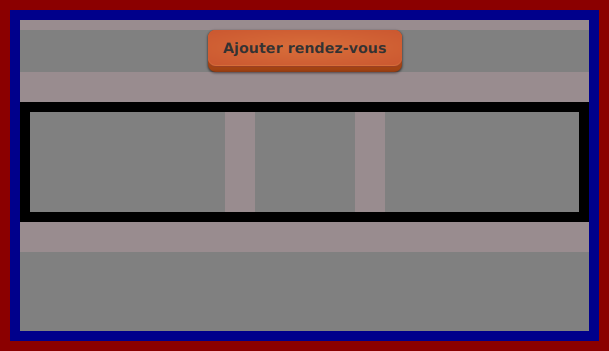

# Tutoriel 8.1: ajouter le `conteneurRendezVous`

## Retirer les éléments graphiques de l'ancien affichage

1. Dans `file_attente.xml`, je retire l'image

    $[xml ./_file_attente_tut07_01]()

1. Je retire aussi le `boutonOuvrirPartie`

    $[xml ./_file_attente_tut07_02]()

    * NOTES:
        * on va plutôt afficher ce bouton sur chaque rendez-vous

1. Finalement, je retire aussi le `labelMessage`

    $[xml ./_file_attente_tut07_03]()

    * NOTES:
        * on va plutôt afficher les rendez-vous avec des éléments graphiques

## Ajouter les nouveaux éléments graphiques

1. Dans `file_attente.xml`, j'ajoute des espacements verticaux et un `HBox`

    $[xml ./file_attente01]()

1. Dans le `HBox`, j'ajoute des espacements horizontaux et le `conteneurRendezVous`

    $[xml ./file_attente02]()

## Modifier la classe `ModeleFileAttente`

1. Dans `ModeleFileAttente`, je dois vider la méthode `afficherSur`

    $[java ./_ModeleFileAttenteTut07_01]()

## Modifier la classe `VueFileAttente` 

1. Dans `VueFileAttente`, je dois retirer les attributs `boutonOuvrirPartie` et `labelMessage`

    $[java ./_VueFileAttenteTut07_01]()

1. Je dois aussi retirer les méthodes qui utilisaient ces attributs

    $[java ./_VueFileAttenteTut07_02]()

1. Finalement, je peux ajouter tout de suite l'attribut `conteneurRendezVous`

    $[java ./VueFileAttente01]()

## Ajouter le CSS

1. J'ouvre `dev.css` et j'ajoute

    $[css ./dev01]()

1. J'ouvre `prod.css` et j'ajoute

    $[css ./prod01]()

## Tester que ça fonctionne

1. Je peux exécuter le client et tester l'affichage (avec `dev.css`)

        $ cd tutoriels
        $ sh gradlew client

    

        
    

    * NOTES:
        * le `conteneurRendezVous` est au milieu (espace vide)
        * le rectangle noir est le `HBox`
        * les rectangles beiges sont les espacements 
            * (qui ne sont pas elastiques pour l'instant)

