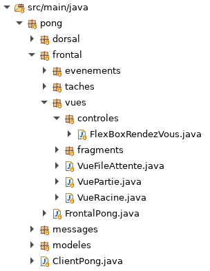

# Tutoriel 8.6: créer et utiliser le `FlexBoxRendezVous`

## Créer la classe `FlexBoxRendezVous`

1. Dans le paquet `vues`, je crée le sous-paquet `controles`

1. Dans le paquet `controles`, je crée la classe `FlexBoxRendezVous`

1. En Eclipse, je m'assure d'avoir l'arborescence suivante:

    

        
    

1. J'ouvre `FlexBoxRendezVous` et j'ajuste la signature:

    $[java ./FlexBoxRendezVous01]()

1. Avec $[kbd](Ctrl+1), j'ajoute le `import` et les méthodes obligatoires

    $[java ./FlexBoxRendezVous02]()
 
## Utiliser le `FlexBoxRendezVous` dans le `.xml`

1. J'ouvre `rendez_vous.xml` et j'ajoute la balise `FlexBoxRendezVous`

    $[xml ./rendez_vous]()

1. J'ouvre `partie_en_cours.xml` et j'ajoute la balise `FlexBoxRendezVous`

    $[xml ./partie_en_cours]()

## Tester que ça fonctionne

1. J'exécute le client et je vérifie que le FlexBox fonctionne

        $ cd tutoriels
        $ sh gradlew client

    <video width="100%" src="flexbox.mp4" type="video/mp4" loop nocontrols autoplay>

## Hum... il manque une barre de défilement

1. Et si on ajoute plus de rendez-vous?

        $ cd tutoriels
        $ sh gradlew client

    <video width="100%" src="besoin_barre.mp4" type="video/mp4" loop nocontrols autoplay>

