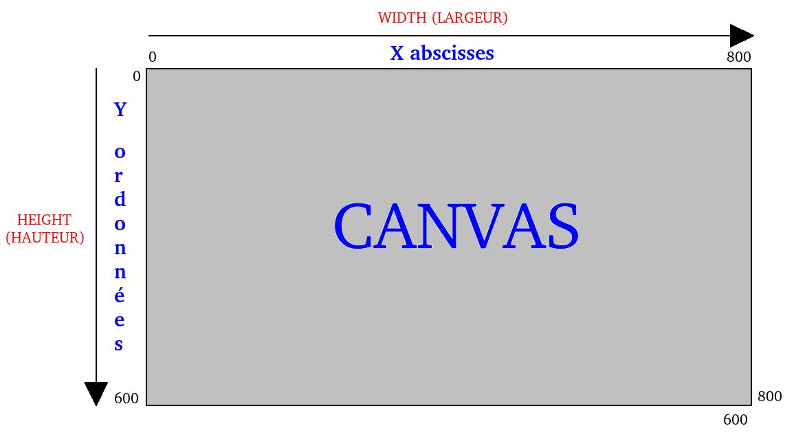

# JavaFX: dessiner

## La toile (`Canvas`)

<video width="50%" src="canvas.mp4" type="video/mp4" controls>

1. La classe `Canvas` spécifie une région 2D où on peut dessiner
1. La région a une largeur et une hauteur
1. **important**: le `(0,0)` est dans le coin haut gauche

    

        
    

1. En Java:

    $[java ./vues07a 1 1]()

## Le pinceau (`GraphicsContext` ou `gc`)

<video width="50%" src="gc.mp4" type="video/mp4" controls>

1. Le gros du travail se fait avec le `GraphicsContext`

    $[java ./vues07a 3 3]()

1. On peut spécifier la mise en forme:

    $[java ./vues07a 6 10]()

    * `fill` est la couleur de fond (remplissage)
    * `stroke` est la couleur du contour (trait)

1. On peut dessiner avec des primitives:

    $[java ./vues07a 12 14]()

1. Et plein d'autre chose <a href="https://docs.oracle.com/javase/8/javafx/api/javafx/scene/canvas/GraphicsContext.html" target="_blank">https://docs.oracle.com/javase/8/javafx/api/javafx/scene/canvas/GraphicsContext.html</a>, p.ex:

    * `drawImage` pour les images *bitmap*
    * `appendSVGPath` pour les images vectorielles
    * `clip` pour afficher seulement une sous-région
    * `translate`, `scale`, `rotate` et `transform` pour appliquer des transformations
    * `applyEffect` pour appliquer des filtres (couleur, flou, etc.)

## Sauvegarder/restaurer le `gc`

<video width="50%" src="save.mp4" type="video/mp4" controls>

1. Il est utile de changer temporairement la mise en forme:

    $[java ./vues07a 16 21]()

    * après `restore`, le `gc` revient à la mise en forme d'avant le `save`

## Il faut rafraîchir la toile manuellement

<video width="50%" src="vider.mp4" type="video/mp4" controls>

1. Pour rafraîchir, on vide une portion de la toile et on redessine

    $[java ./vues07a 22 22]()

1. Typiquement, on vide toute la toile:

    $[java ./vues07a 24 24]()

