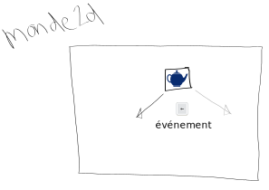

# Théorie: réagir aux événements

<video width="50%" src="evenement.mp4" type="video/mp4" controls>

* Il suffit de changer les attributs de l'objet 2d
* P.ex. on pourrait modifier sa vitesse en recevant la touche $[kbd](←)

    

* L'effet est que l'objet va changer de direction

### En `Ntro`

* Capter les événements du clavier et lancer un événement Ntro

    $[java ./VuePartie]()

* Ajouter une tâche pour l'événement Ntro

    $[java ./AfficherPartie]()

* Appliquer l'événement, p.ex.
    * appeler `palette.monter()` pour la touche `W`
    * appeler `palette.descendre()` pour la touche `S`
    * appeler `palette.arreter()` quand la touche est relâchée

    $[java ./Palette2d]()

