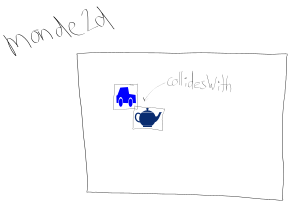

# Théorie: créer un monde 2d

## Le monde 2d

<video width="50%" src="monde2d.mp4" type="video/mp4" controls>

* Un monde 2d est un rectangle avec une largeur et une hauteur
* Le monde 2d contient des objets 2d
* Un objet 2d occupe un rectangle dans lequel son dessin est contenu

    

### En `Ntro`

* Définir un monde 2d

$[java ./MondePong2d01]()

* Ajouter des objets 2d

$[java ./MondePong2d02]()

## Décrire les objets

<video width="50%" src="objet2d.mp4" type="video/mp4" controls>

* Chaque objet 2d a aussi une largeur (`w`) et une hauteur (`h`)
* La position de l'objet 2d est indiquée par son coin haut/gauche (`topLeft`)

    

### En `Ntro`

* Un classe abstraite pour tous les objets 2d

$[java ./ObjetPong2d]()

* Définir un objet 2d

$[java ./Balle2d]()

## Afficher le monde 2d

<video width="50%" src="afficher.mp4" type="video/mp4" controls>

* On va afficher le monde 2d en deux étapes
    1. (optionnel) dessiner une image de fond
    1. itérer chaque objet 2d et demander à cet objet de se dessiner

### En `Ntro`

* Définir un canvas pour afficher le monde 2d

$[java ./CanvasPartie]()

* Initialiser le CanvasPartie (dans une Vue)

$[java ./VuePartie]()

* Appeler la méthode `displayWorld2d` (héritée de `World2dCanvas`)

$[java ./VuePartie02]()

* NOTES
    * le `World2dCanvas` va redimensionner le monde 2d selon le conteneur
    * le ratio largeur/hauteur est préservé automatiquemen

<video width="40%" src="redimensionner.mp4" type="video/mp4" loop nocontrols autoplay>

## Détecter les collisions

<video width="50%" src="collision.mp4" type="video/mp4" controls>

* La collision est calculée selon le rectangle qui entoure l'objet

    

### En `Ntro`

* Collision avec un autre objet

$[java ./Balle2d02]()

* Collision avec un rectangle

$[java ./Balle2d03]()

