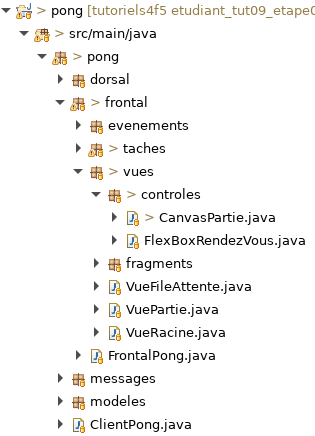

# Tutoriel 9.3: créer le `CanvasPartie` 

1. Si j'ai déjà la classe `CanvasPartie`, je saute à l'étape «Hériter de `World2dCanvas`

1. Sinon, je m'assure d'avoir le paquet `pong.frontal.vues.controles`

1. Dans le paquet `controles`, je crée la classe `CanvasPartie`

1. En Eclipse, je m'assure d'avoir l'arboresence suivante:

    

        
    

## Hériter de `World2dCanvas`

1. J'ouvre `CanvasPartie` et je modifie la signature

    $[java ./CanvasPartie01 1 1]

1. J'utilise $[kbd](Ctrl+1) pour ajouter le `import` de `World2dCanvas`

1. Je m'assure d'avoir le code suivant pour `CanvasPartie`

    $[java ./CanvasPartie01]

## Ajouter un `CanvasPartie` avec `fx:id` à la vue partie

1. Si ce n'est pas déjà fait, j'ouvre `partie.xml` et j'ajoute la balise `CanvasPartie` 
    * **ATTENTION** le canvas partie doit avoir son `fx:id="canvasPartie"`

    $[xml ./partie]()

1. Je m'assure que le client s'exécute sans erreur

        $ cd tutoriels
        $ sh gradlew client

    * NOTES:
        * c'est normal si le canvas n'affiche rien pour l'instant

