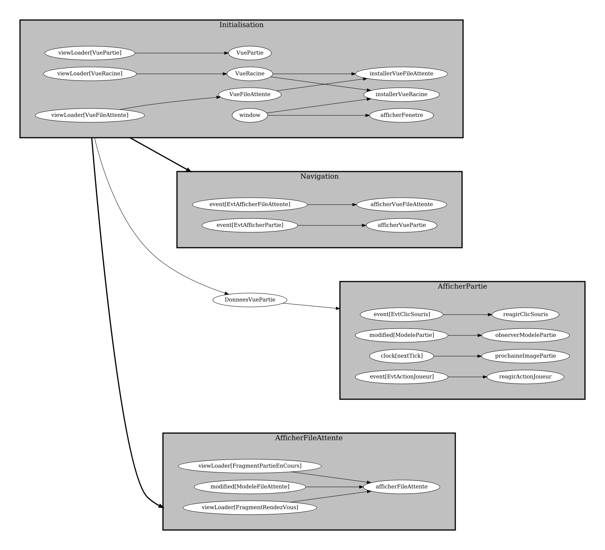

# Optionnel 9.3: réagir aux clics de souris

<strong>NOTES</strong>

<ul>
<li>Ce matériel est moins détaillé que d'habitude.
<li>Au besoin, demander des clarifications au prof.
</ul>

1. Dans `evenements`, ajouter la classe suivante

    $[java ./EvtClicSouris]()

1. Avec `registrar.registerEvent`, **déclarer** l'événement dans le frontal

1. Créer la méthode `reagirClicSouris` avec $[kbd](Ctrl+1)

1. Dans `VuePartie`, ajouter le code suivant

    $[java ./VuePartie]()

1. Dans `AfficherPartie`, ajouter la tâche suivante

    $[java ./AfficherPartie]()

1. Vérifier le graphe de tâches du frontal

    

        
    

1. Dans `DonneesVuePartie`, ajouter le code suivant

    $[java ./DonneesVuePartie]()

1. Dans `Palette2d`, ajouter le code suivant

    $[java ./Palette2d]()

1. Dans `MondePong2d`, ajouter le code suivant

    $[java ./MondePong2d]()

1. Vérifier que ça fonctionne

<video width="100%" src="optionnel03.mp4" type="video/mp4" loop nocontrols autoplay>

