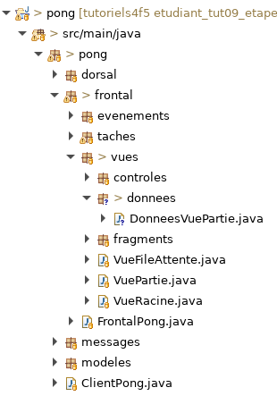
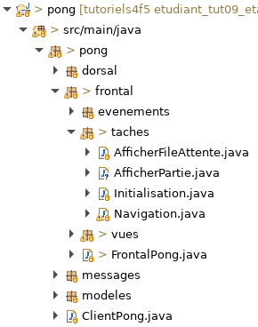
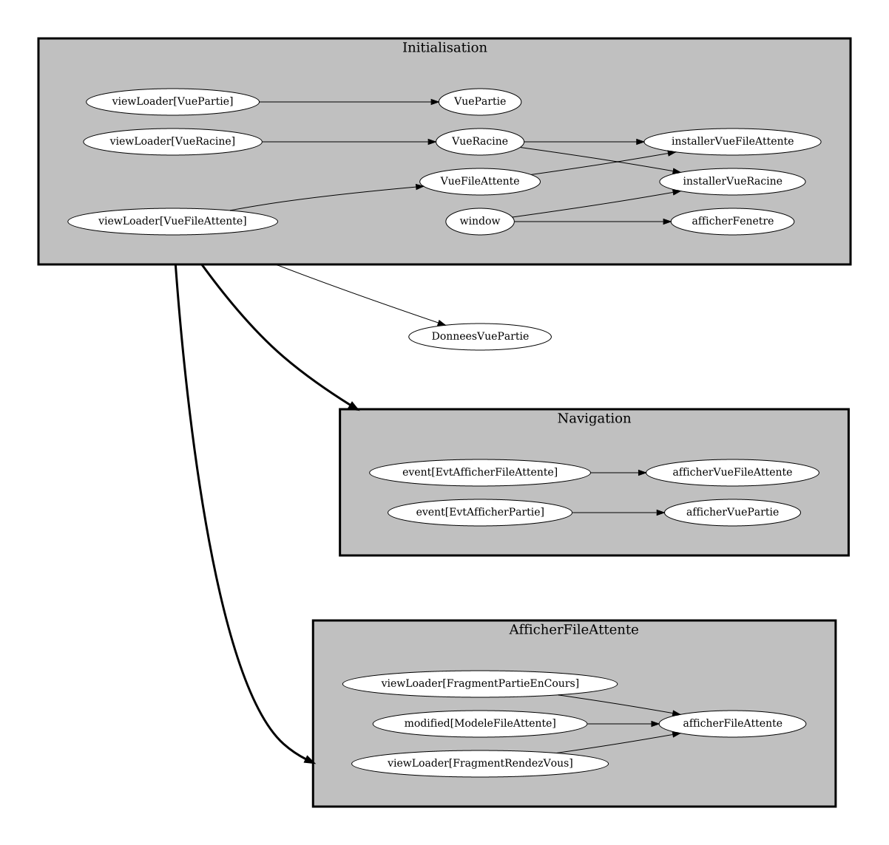

# Tutoriel 9.5: créer `DonneesVuePartie`

## Créer le `ViewData` nommé `DonneesVuePartie`

1. En Eclipse, je crée le paquet `frontal.vues.donnees`

1. Dans le paquet `donnees`, je crée la classe `DonneesVuePartie`

1. En Eclipse, je m'assure d'avoir l'arborescence suivante

    

        
    

1. J'ouvre `DonneesVuePartie` et j'ajuste la signature

    $[java ./DonneesVuePartie01 1 1]()

1. J'utilise $[kbd](Ctrl+1) pour ajouter l'`import` de `ViewData`

1. Dans `DonneesVuePartie`, j'ajoute les attributs suivants

    $[java ./DonneesVuePartie01]()

    * NOTES:
        * le `fpsCourant` est une exemple de données spécifique à la Vue
        * on ne veux pas sauvegarder `fpsCourant` dans le fichier `.json`

## Déclarer `DonneesVuePartie`

1. J'ouvre `FrontalPong` et j'ajoute ce code

    $[java ./FrontalPong01]()

    * NOTES
        * on déclare `DonneesVuePartie` dans le frontal
        * c'est spécifique au frontal, le dorsal n'a pas accès à cet classe

1. J'utilise $[kbd](Ctrl+1) pour ajouter l'`import` de `DonneesVuePartie`

## Instancier notre `DonneesVuePartie` avec une tâche

1. Dans le paquet `frontal.taches`, je crée la classe `AfficherPartie`

1. En Eclipse, je m'assure d'avoir l'arborescence suivante

    

        
    

1. J'ouvre `AfficherPartie` et j'ajoute le code suivant

    $[java ./AfficherPartie01]()

    * NOTES
        * ne pas oublier le `import static`
         
         
         
         `import static ca.ntro.app.tasks.frontend.FrontendTasks.*;` 

1. J'utilise $[kbd](Ctrl+1) et je corrige les erreurs de compilation

1. J'ouvre `FrontalPong` et j'ajoute l'appel à la méthode `AfficherPartie.creerTaches`

    $[java ./FrontalPong02]()

## Tester que ça fonctionne

1. Je m'assure que le client s'exécute sans erreurs

        $ cd tutoriels
        $ sh gradlew client

1. Je vérifie le graphe de mon frontal:

    

        
    

