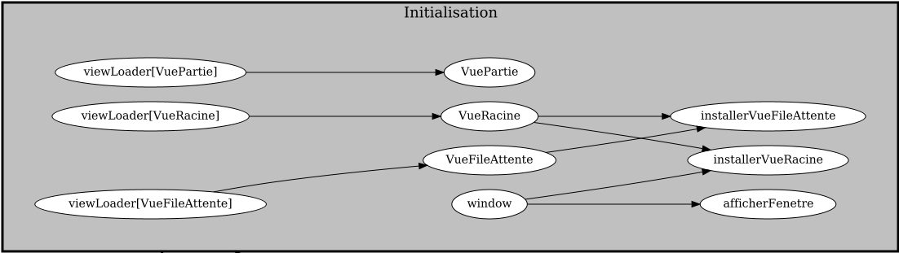

# Tutoriel 9.2: créer la `VuePartie` dans l`Initialisation`

1. En Eclipse, J'ouvre `Navigation` et `Initialisation`

1. Je copie le code suivant à partir de `Navigation` dans `Initialisation`

    * à copier

        $[java ./tut08_Navigation01]()

    * ici

        $[java ./Initialisation01]()

1. Dans `Initialisation`, j'utilise $[kbd](Ctrl+1) pour insérer le `import` de `VueRacine`

1. Je retire le code suivant de `Navigation`

    $[java ./tut08_Navigation02]()

1. Je m'assure que tout fonctionne

        $ cd tutoriels
        $ sh gradlew client

1. Je vérifie le graphe de mon frontal:

    

        
    

1. En particulier, pour l'`Initialisation`

    

        
    

    * NOTES:
        * on va avoir besoin de la `VuePartie` à plus d'un endroit 
            * (pas uniquement dans la `Navigation`)
        * il est préférable de la crée dès l'`Initialisation`
