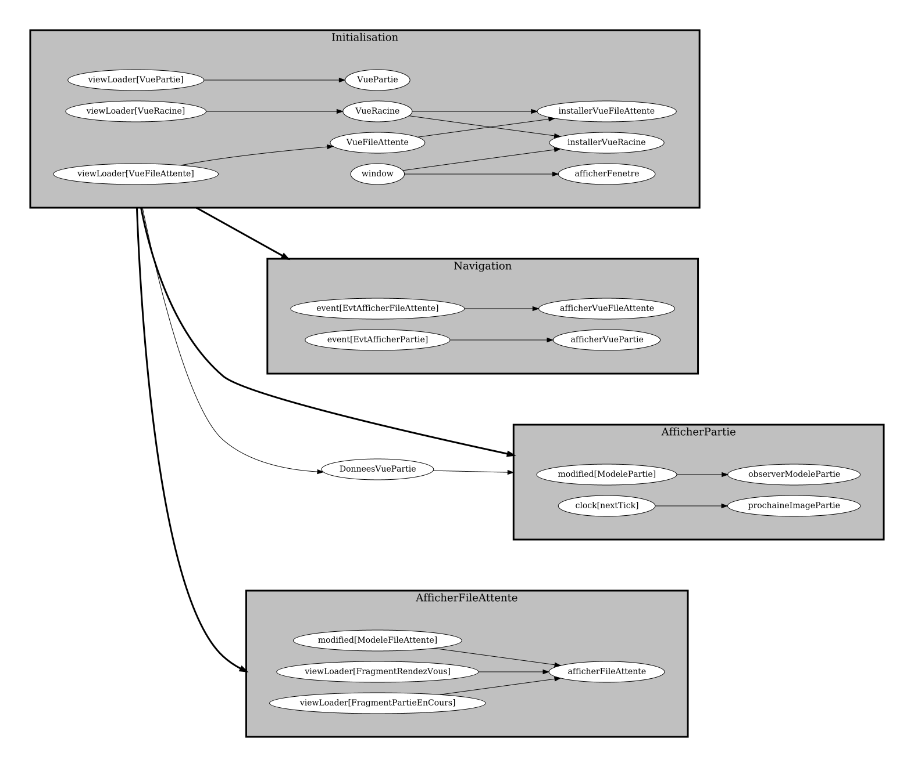
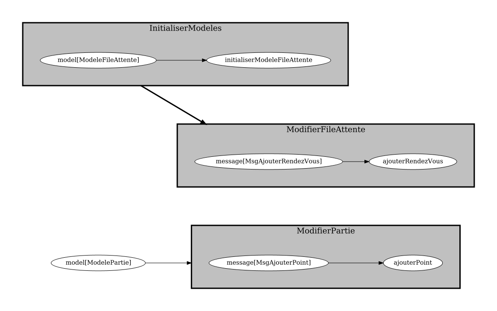

# Optionnel 9.1: créer un `ModelePartie`

<strong>NOTES</strong>

<ul>
<li>Ce matériel est moins détaillé que d'habitude.
<li>Au besoin, demander des clarifications au prof.
</ul>

1. Dans `partie.xml`, ajouter le FXML pour afficher les noms et le pointage

    $[xml ./partie]()

    * $[download ./partie.xml](télécharger) l'extrait au besoin

1. Dans `VuePartie`, ajouter le code suivant

    $[java ./VuePartie]()

1. Dans `DonneesVuePartie`, ajouter le code suivant

    $[java ./DonneesVuePartie]()

1. Créer un paquet `modeles.enums` 

1. Dans `modeles.enums`, créer l'enum suivant

    $[java ./Cadran]()

1. Dans `modeles`, créer la classe suivante

    $[java ./ModelePartie]()

1. Avec `registrar.registerModel`, **déclarer** le modèle dans le client

1. Avec `registrar.registerValue`, **déclarer** les valeurs suivantes dans le client
    * `MondePong2d`
    * `Balle2d`

1. Dans `messages`, ajouter la classe suivante

    $[java ./MsgAjouterPoint]()

1. Avec `registrar.registerMessage`, **déclarer** le message dans le client

1. Dans `AfficherPartie`, ajouter la tâche `observerModelePartie`

    $[java ./AfficherPartie]()

1. Vérifier le graphe du frontal

    

        
    

1. Dans le dorsal, créer la classe `taches.ModifierPartie`

    $[java ./ModifierPartie]()

1. **Appeler** `ModifierPartie.creerTaches()` dans `DorsalPong`

1. Vérifier le graphe du dorsal

    

        
    

1. Dans `Balle2d`, ajouter le code pour compter des points

    $[java ./Balle2d]()

1. Vérifier que ça fonctionne

<video width="50%" src="optionnel01.mp4" type="video/mp4" loop nocontrols autoplay>

    
