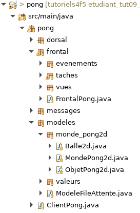

# Tutoriel 9.4: créer un monde 2d

## Créer le monde et les objets

1. En Eclipse, je crée le paquet `pong.modeles.monde_pong2d`

1. Dans le paquet `monde_pong2d`, je crée les classes suivantes

    * `MondePong2d`
    * `Objet2d`
    * `Balle2d`

1. En Eclipse, je m'assure d'avoir l'arborescence suivante

    

        
    

1. J'ouvre `MondePong2d` et j'ajuste la signature

    $[java ./MondePong2d01 1 4]()

1. J'ouvre `Objet2d` et j'ajuste la signature

    $[java ./ObjetPong2d01 1 4]()

    * **ATTENTION**: c'est une classe abstraite

1. J'ouvre `Balle2d` et j'ajuste la signature

    $[java ./Balle2d 1 1]()

1. J'utilise $[kbd](Ctrl+1) pour ajouter les `import` et les méthodes obligatoires

1. J'ajoute le code suivant dans `MondePong2d`

    $[java ./MondePong2d01]()

1. J'ajoute le code suivant dans `Balle2d`

    $[java ./Balle2d01]()

## Initialiser le `CanvasPartie`

1. J'ouvre `VuePartie` et j'ajoute le code suivant

    $[java ./VuePartie01]()

1. J'utilise $[kbd](Ctrl+1) pour corriger les erreurs de compliation

1. Je m'assure que le client s'exécute sans erreur

        $ cd tutoriels
        $ sh gradlew client

    * NOTES:
        * c'est normal si le canvas n'affiche rien
        * on a pas encore instancié notre `MondePong2d`!
