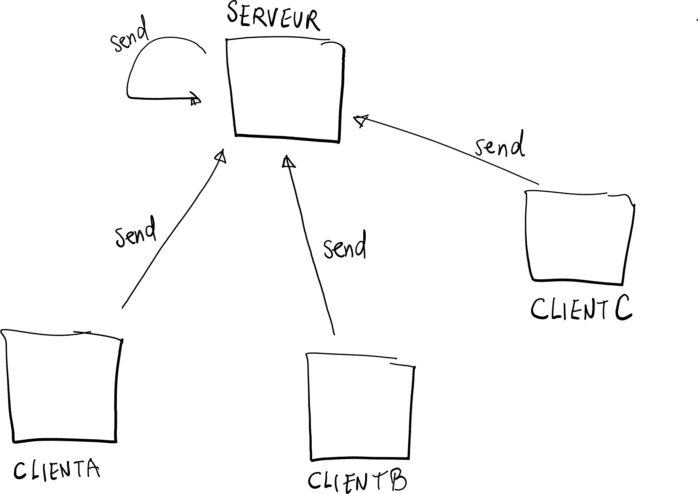
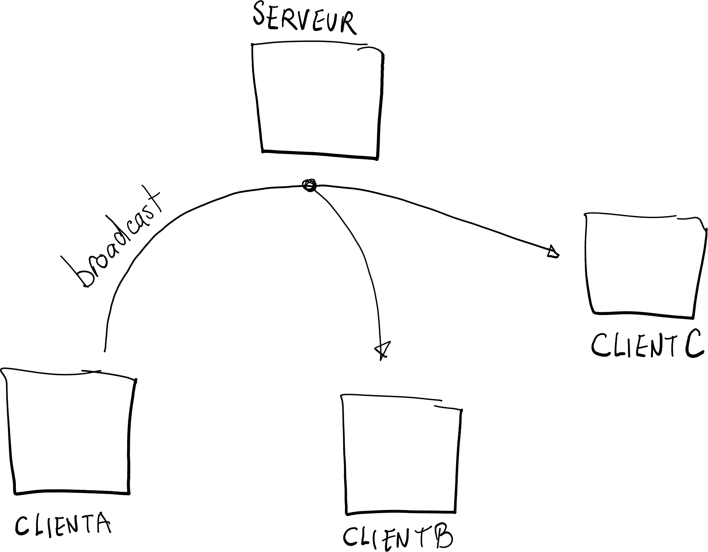
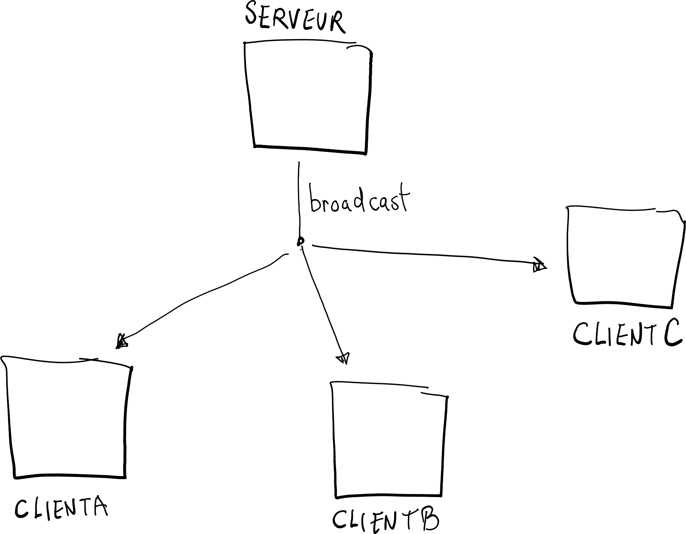

# Théorie: envoyer Vs diffuser

<video width="50%" src="intro.mp4" type="video/mp4" controls>

* Il y a deux façons d'envoyer un message

    * envoyer

        $[java ./Envoyer]()

    * diffuser

        $[java ./Diffuser]()

## Envoyer

<video width="50%" src="envoyer.mp4" type="video/mp4" controls>

* Envoyer veut dire: «envoyer vers le dorsal»

* En mode client/serveur, ça donne

    

        
    

## Diffuser

<video width="50%" src="diffuser.mp4" type="video/mp4" controls>

* Diffuser veut dire: «envoyer vers le frontal»

* En mode client/serveur, diffuser est soit

    * envoyer vers les autres clients (à travers le serveur)

        

            
        

    * envoyer vers les clients (à partir du serveur)

        

            
        

        
       
