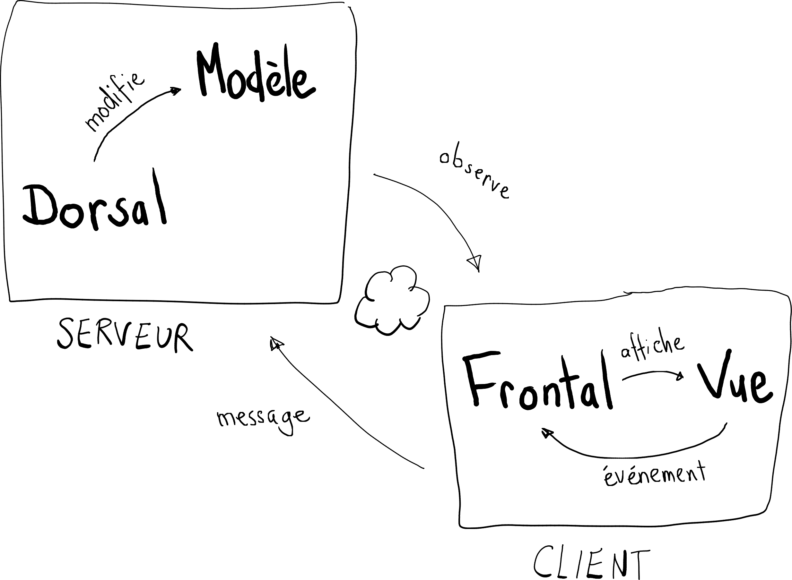
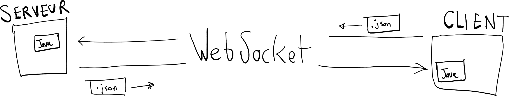

# Théorie: MVC `Ntro` en mode client/serveur

<video width="50%" src="mvc01.mp4" type="video/mp4" controls>

* Conceptuellement, le MVC `Ntro` est

    

        
    

<video width="50%" src="client_serveur_frontal_dorsal.mp4" type="video/mp4" controls>

* Jusqu'à maintenant on a fait le cas 1 ci-bas
    * le dorsal et le frontal sur le client
    * aucun serveu

    

        
    

* On va maintenant s'intéresser au cas 3 
    * le frontal dans le client
    * le dorsal dans le serveur
    * communication par messages entre le client et le serveur
    * communication par messages entre le frontal et le dorsal

<video width="50%" src="mvc02.mp4" type="video/mp4" controls>

* Dans le cas client/serveur, le MVC `Ntro` devient

    

        
    

<video width="50%" src="websocket.mp4" type="video/mp4" controls>

* Toutes les communications entre le dorsal et le frontal transite par le réseau

* Pour ce faire, on utilise un lien `WebSocket`

    

        
    

    * un WebSocket est bi-directionnel
    * pour les envoyer, les messages sont toujours convertis en `.json` 
    * lorsque reçu, un message est reconverti en Java

<video width="50%" src="websocket02.mp4" type="video/mp4" controls>

* Avantages du protocole `WebSocket`
    * supporté par les navigateurs Web
    * bâti par dessus HTTP, donc compatible avec les pare-feu
    * garanti l'ordre des messages

* Inconvénients du protocole `WebSocket`
    * connexion réputée fragile (il faut alors reconnecter)
    * pas de mode *brut* (mode *UDP* ou *streaming*)
        * pour un jeu en ligne, c'est le mode qu'il nous faudrait
        * la transmission est plus rapide, mais
            * l'ordre n'est pas garanti
            * les messages perdus sont ignorés
