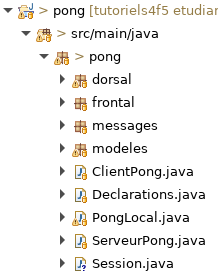

# Tutoriel 10.3: simuler la session

## Ajouter la Session

1. Au besoin, je crée le paquet `modeles.enums`

1. Dans le paquet `enums`, je crée l'enum `Cadran`

1. J'ouvre `Cadran` et j'ajoute le code suivant:

    $[java ./Cadran01]

1. Dans le paquet `pong`, je crée la classe `Session`

1. En Eclipse, je m'assure d'avoir l'arborescence suivante

    

        
    

1. J'ouvre `Session` et j'ajoute le code suivant

    $[java ./Session01]()

1. J'ouvre `VueFileAttente` et je modifie le code

    $[java ./VueFileAttente01]()

1. J'ouvre `ClientPong` et j'ajoute le code suivant

    $[java ./ClientPong01]()

## Créer la session au démarrage

1. Dans `pong/build.gradle`, j'ajoute `alice`

    <pre>
    task(alice, dependsOn: 'classes', type: JavaExec) {
       configure clientConfig
       args("Alice","GAUCHE")
    }

    </pre>

1. Dans `pong/build.gradle`, j'ajoute `bob`

    <pre>
    task(bob, dependsOn: 'classes', type: JavaExec) {
       configure clientConfig
       args("Bob", "DROITE")
    }
    </pre>

1. Dans `pong/build.gradle`, j'ajoute `charlie`

    <pre>
    task(charlie, dependsOn: 'classes', type: JavaExec) {
       configure clientConfig
       args("Charlie","AUCUN")
    }
    </pre>

## Vérifier que ça fonctionne

1. Dans **4 GitBash différents**, j'exécute

        $ sh gradlew serveur
        $ sh gradlew alice
        $ sh gradlew bob
        $ sh gradlew charlie

1. J'ajoute des rendez-vous pour vérifier les noms

    

     <video width="100%" src="sessions.mp4" type="video/mp4" loop nocontrols autoplay>
    

