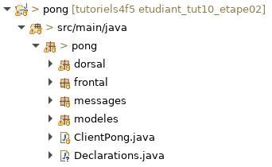
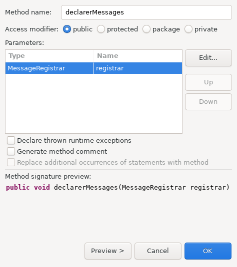
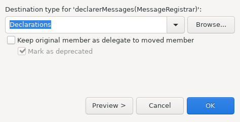
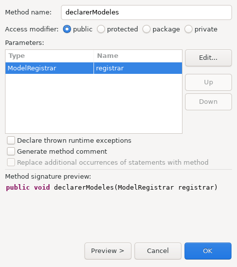
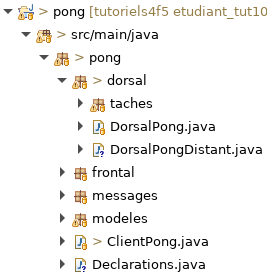
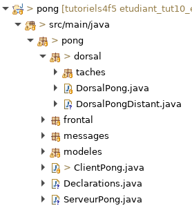
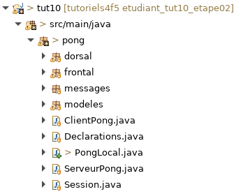

# Tutoriel 10.2: client/serveur et portable

## Regrouper les déclarations communes

1. Dans le paquet `pong`, je crée la classe `Declarations`

1. En Eclipse, je m'assure d'avoir l'arborescence suivante:

    

        
    

1. J'ouvre `ClientPong` dans le but d'en extraire les déclarations
    * on va le transférer dans les méthodes statiques de `Declarations`

### Extraire la déclaration des messages

1. Dans `ClientPong`, je sélectionne l'intérieur de la méthode `registerMessages`

1. Avec $[kbd](Shift+Alt+M), je vais extraire une méthode pour ce code

1. Je nomme cette méthode `declarerMessages` et je coche `public`, puis *OK*

    

        
    

1. J'ajuste la signature de la nouvelle méthode `declarerMessage` pour qu'elle soit `static`

    $[java ./Declarations01 3 3]()

1. Je place mon curseur sur la nouvelle méthode `declarerMessage`

1. Avec $[kbd](Shift+Alt+V), je vais déplacer la méthode dans `Declarations`

    

        
    

### Extraire la déclaration des modèles

1. Dans `ClientPong`, je sélectionne l'intérieur de la méthode `registerModels`

1. Avec $[kbd](Shift+Alt+M), je vais extraire une méthode pour ce code

1. Je nomme cette méthode `declarerModeles` et je coche `public`, puis *OK*

    

        
    

1. J'ajuste la signature de la nouvelle méthode `declarerModeles` pour qu'elle soit `static`

    $[java ./Declarations01 9 9]()

1. Je place mon curseur sur la nouvelle méthode `declarerModeles`

1. Avec $[kbd](Shift+Alt+V), je vais déplacer la méthode dans `Declarations`

    

        
    

### Vérifier

1. Je devrais maintenant avoir à peu près ce code dans `ClientPong`

    $[java ./ClientPong01]

1. Je devrais maintenant avoir à peu près ce code dans `Declarations`

    $[java ./Declarations01]

1. Je peux encore exécuter le client

        $ cd tutoriels
        $ sh gradlew client

## Créer la version client/serveur

1. Dans `dorsal`, je crée la classe `DorsalPongDistant`

1. En Eclipse, je m'assure d'avoir l'arborescence suivante:

    

        
    

1. J'ouvre `DorsalPongDistant` et j'ajoute ce code

    $[java ./DorsalPongDistant01]()

1. Avec $[kbd](Ctrl+1), je crée la méthode `Declarations.declarerServeur`

1. Dans `Declarations`, je complète le code de cette méthode

    $[java ./Declarations02]()

1. Dans `ClientPong`, je modifie `registerBackend` pour utiliser le nouveau Dorsal distant

    $[java ./ClientPong02]()

1. Si j'exécute le client, je vais maintenant avoir une erreur de connexion

        $ cd tutoriels
        $ sh gradlew client

            # Devrait quitté sur une erreur

            [INFO] Ntro version 1.0
            [INFO] Locale: 'fr_CA'

            [FATAL] failed to connect to ws://localhost:8002

            [EXITING]

## Créer le serveur

1. Dans `pong`, j'ajoute la classe `ServeurPong`

1. En Eclipse, je m'assure d'avoir l'arborescence suivante:

    

        
    

1. J'ouvre `ServeurPong` et j'ajoute le code suivant

    $[java ./ServeurPong01]()

    * NOTES
        * c'est maintenant le serveur qui exécute le `DorsalPong` local

## Exécuter le serveur
 
1. J'ouvre `gradle.properties` et j'ajoute

    <pre>
        serverMainClass=pong.ServeurPong
    </pre>

1. J'ouvre `pong/build.gradle` et j'ajoute

    <pre>
        def serverConfig = {
            configure commonConfig
            main = serverMainClass
        }

        task(serveur, dependsOn: 'classes', type: JavaExec) {
            configure serverConfig
        }
    </pre>

1. Je peux maitenant exécuter le serveur comme suit

        $ cd tutoriels
        $ sh gradlew serveur

            # Devrait afficher

            [INFO] Ntro version 1.0
            [INFO] Locale: 'fr_CA'
            [INFO] Server running. Press Enter here to exit.

            [INFO] Listening on ws://localhost:8002

## Exécuter en mode client/serveur

1. Avec le serveur qui roule, j'ouvre un autre GitBash pour faire

        $ cd tutoriels
        $ sh gradlew client

            # Devrait maintenant afficher

            [INFO] Ntro version 1.0
            [INFO] Locale: 'fr_CA'

            [INFO] connected to ws://localhost:8002

            [INFO] App running. Press Enter here to exit.

1. Avec le serveur et un client qui roulent, j'ouvre un troisème GitBash pour faire

        $ cd tutoriels
        $ sh gradlew client

1. Je devrais déjà voir que `ModeleFileAttente` est synchronisé via la serveur

    
    

     <video width="100%" src="client_serveur.mp4" type="video/mp4" loop nocontrols autoplay>
    

    * NOTES
        * toujours utiliser plusieurs GitBash pour lancer plusieurs programmes
        * attendre que le serveur soit bien lancé avant de lancer un client
        * attendre qu'un soit bien lancé avant d'en lancer un autre

1. En cas d'erreur du type `java.net.BindException: Adresse déjà utilisée`, faire

        
        # ERREUR!

        java.net.BindException: Adresse déjà utilisée

        [FATAL] Cannot listen on ws://localhost:8002
                Port already in use?

        # Faire

        $ cd tutoriels
        $ sh gradlew --stop

        # Puis relancer le serveur
        $ sh gradlew serveur

## Créer la version locale

1. En Eclipse, je fais un copier-coller de la classe `ClientPong`
    * je renomme la classe `PongLocal`

1. Je m'assure d'avoir l'arborescence suivante:

    

        
    

1. J'ouvre `PongLocal` et je modifie le `registerBackend` pour utiliser le `DorsalPong` local

    $[java ./PongLocal01]()

## Exécuter la version locale

1. J'ouvre `gradle.properties` et j'ajoute

    <pre>
        localMainClass=pong.PongLocal
    </pre>

1. J'ouvre `pong/build.gradle` et j'ajoute

    <pre>
        def localConfig = {
            configure commonConfig
            main = localMainClass
            jvmArgs('-Dsun.java2d.opengl=true')
        }
    </pre>

    <pre>
        task(local, dependsOn: 'classes', type: JavaExec) {
           configure localConfig
           jvmArgs('-Duser.language=fr')
        }
    </pre>

    <pre>
        task(localEn, dependsOn: 'classes', type: JavaExec) {
           configure localConfig
           jvmArgs('-Duser.language=en')
        }
    </pre>

1. Je quitte le `ServeurPong` s'il est allumé

1. J'exécute `PocalLocal`, la version hors-ligne

        $ cd tutoriels
        $ sh gradlew local

    * NOTES
        * cette version est utile pour tester rapidement

