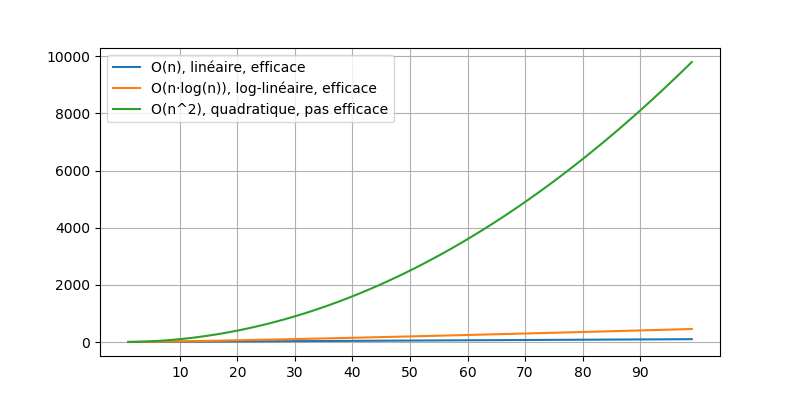

# Les structures de données expliquées avec des cartes

* 6 vidéos
* temps total: 20 minutes

## Intro

<iframe width="560" height="315" src="https://www.youtube.com/embed/lknxfG4wELc" title="YouTube video player" frameborder="0" allow="accelerometer; autoplay; clipboard-write; encrypted-media; gyroscope; picture-in-picture" allowfullscreen></iframe>

<!--

<video width="50%" src="intro.mp4" type="video/mp4" controls>

-->

## Le tri

<iframe width="560" height="315" src="https://www.youtube.com/embed/fcHvrHlFvPo" title="YouTube video player" frameborder="0" allow="accelerometer; autoplay; clipboard-write; encrypted-media; gyroscope; picture-in-picture" allowfullscreen></iframe>

<!--

<video width="50%" src="intro_tri.mp4" type="video/mp4" controls>

-->

## Le tri «humain»

<iframe width="560" height="315" src="https://www.youtube.com/embed/-Kd2yO4Ee1s" title="YouTube video player" frameborder="0" allow="accelerometer; autoplay; clipboard-write; encrypted-media; gyroscope; picture-in-picture" allowfullscreen></iframe>

<!--

<video width="50%" src="tri_humain.mp4" type="video/mp4" controls>

-->

#### tri «humain» à l'écran

<iframe width="560" height="315" src="https://www.youtube.com/embed/ygwiz1ETIGc" title="YouTube video player" frameborder="0" allow="accelerometer; autoplay; clipboard-write; encrypted-media; gyroscope; picture-in-picture" allowfullscreen></iframe>

<!--
<video width="80%" src="tri_humain_a_l_ecran.mp4" type="video/mp4" loop nocontrols autoplay></video>
-->

#### tri «humain» en code JSON

<iframe width="560" height="315" src="https://www.youtube.com/embed/jSUtbZwfj8U" title="YouTube video player" frameborder="0" allow="accelerometer; autoplay; clipboard-write; encrypted-media; gyroscope; picture-in-picture" allowfullscreen></iframe>

<!--
<video width="80%" src="tri_humain_en_json.mp4" type="video/mp4" loop nocontrols autoplay></video>
-->

#### tri «humain» avec des données en Java

<iframe width="560" height="315" src="https://www.youtube.com/embed/qZI5XzwXiuA" title="YouTube video player" frameborder="0" allow="accelerometer; autoplay; clipboard-write; encrypted-media; gyroscope; picture-in-picture" allowfullscreen></iframe>

<!--
<video width="50%" src="tri_humain_donnees_java.mp4" type="video/mp4" loop nocontrols autoplay></video>
-->

## Le tri en programmation

<iframe width="560" height="315" src="https://www.youtube.com/embed/jL0kfK_gkXs" title="YouTube video player" frameborder="0" allow="accelerometer; autoplay; clipboard-write; encrypted-media; gyroscope; picture-in-picture" allowfullscreen></iframe>

<!--

<video width="50%" src="tri_naif.mp4" type="video/mp4" controls>

-->

## Efficacité

<iframe width="560" height="315" src="https://www.youtube.com/embed/ZVBhstBmM7E" title="YouTube video player" frameborder="0" allow="accelerometer; autoplay; clipboard-write; encrypted-media; gyroscope; picture-in-picture" allowfullscreen></iframe>

<!--

<video width="50%" src="tri_naif_efficacite.mp4" type="video/mp4" controls>

-->

 
 
 
 

#### Efficace Vs inefficace en théorie

#### Efficace Vs inefficace mesuré

## Un tri efficace

<iframe width="560" height="315" src="https://www.youtube.com/embed/WJc0zC5fur0" title="YouTube video player" frameborder="0" allow="accelerometer; autoplay; clipboard-write; encrypted-media; gyroscope; picture-in-picture" allowfullscreen></iframe>

<!--

<video width="50%" src="tri_fusion.mp4" type="video/mp4" controls>

-->

* L'efficacité du tri fusion est `O(log(n)·n)` 

* Les algorithmes `O(log(n)·n)` sont presques aussi efficaces que `O(n)`:

    

 
 
 
 
 

# NOTES

## Installation temporaire

* J'ai dû tourner avec ma Webcam, d'où la piètre qualité d'image (et l'effet branlant)
* Le Collège Montmorency possède une «caméra document» que je pourrai utiliser pour d'éventuelles vidéos finales

