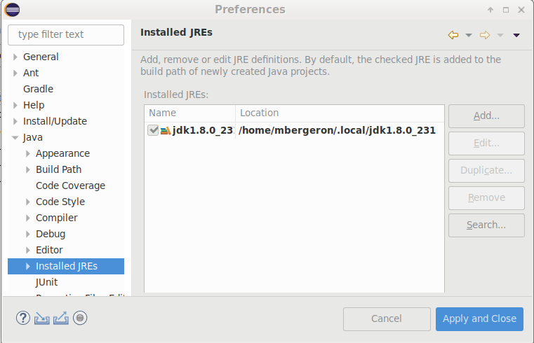

# Tutoriel 1.2: utilisation JDK et Eclipse

**IMPORTANT**: 

* Certaines étapes sont à faire **Uniquement sur votre Windows**
	* Vous pouvez ignorer ces étapes si vous travailler sur le poste du Collège.

## Uniquement sur votre Windows: installer le JDK 1.8

1. Je navigue vers <a target="_blank" href="https://www.oracle.com/java/technologies/javase/javase-jdk8-downloads.html">https://www.oracle.com/java/technologies/javase/javase-jdk8-downloads.html</a>

1. Je télécharge la bonne version pour mon ordi, p.ex. `jdk-8u261-windows-x64.exe`
    * au besoin, je crée un compte Oracle

1. J'exécute l'installateur et je suis les instructions

<!--

## Uniquement sur votre Windows: configurer GitBash

1. J'ouvre une fenêtre GitBash

1. Je crée le fichier `~/.bash_profile` avec le chemin vers le `jdk`

		$ ls -Qd /c/Program\ Files/Java/jdk1.8.XXX/ >> ~/.bash_profile

	* Je dois faire $[kbd](Tab) pour auto-compléter 
	* Je dois obtenir le vrai chemin sans `XXX`

1. J'ouvre `~/.bash_profile` et je m'assure d'avoir:

        $ EDITEUR ~/.bash_profile

            export JAVA_HOME="/c/Program Files/Java/jdk1.8.XXX"/
            export PATH=$JAVA_HOME/bin:$PATH

    * où `EDITEUR` est l'éditeur de votre choix: `vim`, `nano`, `vscode`, ...
    * J'écris exactement `JAVA_HOME` et `PATH`

1. Je redémarre GitBash ou je recharge la configuration:

        $ source ~/.bash_profile

1. Je vérifie que `javac` et `java` s'exécute:

        $ javac 
        $ java

1. Je vérifie que la version est bien **1.8**:

        $ javac -version

            javac 1.8.0_261

-->

## Uniquement sur votre Windows: installer Eclipse

1. Je navigue vers <a href="https://www.eclipse.org/downloads/">https://www.eclipse.org/downloads/</a> et je télécharge l'installateur d'Eclipse

1. J'exécute l'installateur:
    * Je choisis *Eclipse IDE for Java Developers*
    * Je suis les instructions

## Uniquement sur votre Windows: configurer Eclipse

1. Je démarre Eclipse

1. Je choisis l'emplacement de mon workspace

1. Je configure le workspace pour utiliser uniquement le jdk **1.8**

    * *Window* => *Preferences* => *Java* => *Installed JREs*
	    

		    
	    

    * Il doit y avoir **uniquement** le `jdk1.8.XXX`
        * au besoin, j'efface les autres versions
    * Au besoin, j'ajoute le JDK 1.8 (ou le JRE 1.8):
	    * *Add* =>
	    * *Standard VM* => *Next*
	    * Je sélectionne le répertoire racine du *JDK*, p.ex: 
		    * `C:\Program Files\Java\jdk1.8.XXX`
	    * *Finish*
	    * *Apply and Close*

1. Je configure le compilateur pour utiliser uniquement **1.8**

    * *Window* => *Preferences* => *Compiler*
    * Je m'assure que *JDK Compliance* est à **1.8**
	    

		    
	    

<!--

## Uniquement sur votre Windows: nouveau projet en Bash

1. Je navigue à la racine d'un dépôt Git, p.ex.

        $ cd ~/tutoriels_3c6/tutoriel1.1

1. Je crée le répertoire racine du nouveau projet

        $ mkdir en_bash

1. Je navigue à l'intérieur de ce nouveau répertoire

        $ cd en_bash

1. Je crée les répertoires pour les fichiers `.java` et `.class`

        $ mkdir src
        $ mkdir bin

1. Je crée les répertoire pour un paquet `en_bash`

        $ mkdir src/en_bash
        $ mkdir bin/en_bash

1. Je crée un nouveau fichier `Principal.java`

        $ touch src/en_bash/Principal.java

1. J'ajoute le code pour la classe `Principal.java` et la méthode `main`

        $ EDITEUR src/en_bash/Principal.java

    $[java ./Principal]()

1. J'ajoute un script pour compiler

        $ EDITEUR compiler.sh

            javac src/en_bash/Principal.java
            mv src/en_bash/Principal.class bin/en_bash/

1. J'ajoute un script pour exécuter

        $ EDITEUR executer.sh

            java -cp bin en_bash.Principal

1. Je vérifie que le programme compile et exécute sans erreur

        $ sh compiler.sh
        $ sh executer.sh

            Bonjour!

1. J'ajoute le fichier `Principal.java` dans Git

        $ git add src/en_bash/Principal.java

1. Je fais un commit

        $ git commit 
        $ git push

1. J'ajoute un fichier `.gitignore`

        $ EDITEUR .gitignore

            bin

1. J'ajoute les autres fichiers dans Git

        $ git add .

1. Je fais un deuxième commit

        $ git commit -a
        $ git push

-->

    

## Nouveau projet en Eclipse

1. Je crée un projet nommé `en_eclipse`
    * *File* => *New* => *Java Project*
        * Je décoche *Use default location*
            * je navigue à la racine d'un dépôt Git
                * p.ex. `~/tutoriels_3c6/tutoriel1.1`
            * je crée un nouveau répertoire nommé `en_eclipse`
            * je sélectionne ce nouveau répertoire
        * Je vérifie que le projet utilise le JDK **1.8**
        * Je clique sur *Finish*

1. Je m'assurer que l'encodage du projet est `utf-8`
    * *Clique-droit* sur le projet => *Properties*
        * *Text file encoding* 
            * *Other*: `UTF-8`
    * Je clique sur *Apply and Close*

1. Je crée une nouvelle classe nommée `Principal`
    * *Clique-droit* sur le projet => *New* => *Class*
        *  *Name*: `Principal`

1. J'ouvre `Principal.java` et j'ajoute une méthode `main`

    $[java ./Principal 3 9]()

1. Je vérifie que le programme s'exécute en cliquant `▶`

1. J'ajoute le fichier `Principal.java` à Git
    * *Clique-droit* sur le fichier => *Team* => *Add to Index*

1. Je fais un commit
    * *Clique-droit* sur le projet => *Team* => *Commit*
        * J'ajoute mon commentaire de commit
        * Je clique sur *Commit*

1. Je fais un push

        $ cd ~/tutoriels_3c6/tutoriel1.1
		$ git push

        

