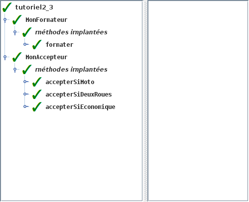

# Tutoriel 2.3: polymorphisme

## Objectifs

1. En utilisant Eclipse, je crée un nouveau projet Java
    * Le projet doit **obligatoirement** être comme suit:
        * nom du projet: `tutoriel2_3`
        * chemin du projet: `~/3c6_PRENOM_NOM/tutoriel2_3`
        * le projet doit utiliser le **JDK 1.8**
        * le projet utilise la librairie $[download ./tutoriel2_3.jar](tutoriel2_3.jar)
        * le projet utilise la base de données $[download ./tutoriel2_3.db](tutoriel2_3.db)

1. Je crée la classe `MonTutoriel2_3` qui hérite de la classe `Tutoriel2_3`

1. Je crée la classe `MonAccepteur` qui implante l'interface `Accepteur`
    * la méthode `accepterSiDeuxRoues(Vehicule vehicule)` doit:
        * retourner vrai si le `vehicule` a deux roues
        * retourner faux sinon
    * la méthode `accepterSiEconomique(Vehicule vehicule)` doit:
        * retourner vrai si la consomation du `vehicule` est `6.0` ou moins
        * retourner faux sinon
    * la méthode `accepterSiMoto(Vehicule vehicule)` doit:
        * retourner vrai si le `vehicule` est une `Moto`
        * retourner faux sinon

1. Je crée la classe `MonFormateur` qui implante l'interface `Formateur`
    * la méthode `formater(Vehicule vehicule)` doit retourner:
        * `"Un/e VEHICULE est un véhicule à ROUES roues. Sa comsomation d'essence est CONSO litres par kilomètre."`
        * où:
            * `Un` ou `Une` selon le type de `vehicule`
            * `VEHICULE` est remplacé par le type de `vehicule`
            * `ROUES` est remplacé par le nombre de roues du `vehicule`
            * `CONSO` est remplacé par la consomation du `vehicule`

1. J'implante les méthodes `fournirAccepteur` et `fournirFormateur`

1. J'ajoute une méthode `main` à la classe `MonTutoriel2_3`:

    $[java ./MonTutoriel2_3 3 6]()

1. J'exécute mon projet et je valide mes classes et mes méthodes

1. J'ajoute les fichiers du projet dans Git 

1. Je fais un `commit` et un `push`

## Réalisation

### Étape 01: créer le projet `tutoriel2_3`

1. Je crée un projet nommé `tutoriel2_3`
    * *File* => *New* => *Java Project*
        * Je décoche *Use default location*
            * je navigue à la racine du dépôt Git `~/3c6_PRENOM_NOM`
            * je crée un nouveau répertoire nommé `tutoriel2_3`
            * je sélectionne ce nouveau répertoire
        * Je vérifie que le projet utilise le JDK **1.8**
        * Je clique sur *Finish*

### Étape 02: ajouter la librairie `tutoriel2_3.jar`

1. Je télécharge le fichier $[download ./tutoriel2_3.jar](tutoriel2_3.jar) et je le place **à la racine du projet**

1. Je rafraîchis Eclipse afin de voir le fichier `.jar`
    * *Clique-droit* sur le projet => *Refresh*

1. J'ajoute la librairie au `classpath`:
    * *Clique-droit* sur le projet => *Build path* => *Configure Build Path*
        * Onglet *Librairies* =>
        * Je clique sur *Add JARs...*
            * je sélectionne le projet `tutoriel2_3`
            * je sélectionne le fichier `tutoriel2_3.jar`
        * Je clique sur *Apply and Close*

### Étape 03: ajouter la base de données `tutoriel2_3.db`

1. Je télécharge le fichier $[download ./tutoriel2_3.db](tutoriel2_3.db) et je le place **à la racine du projet**

1. Je rafraîchis Eclipse afin de voir le fichier `.db`
    * *Clique-droit* sur le projet => *Refresh*

### Étape 04: créer la classe `MonTutoriel2_3`

1. Je crée une nouvelle classe nommée `MonTutoriel2_3`
    * *Clique-droit* sur le projet => *New* => *Class*
        *  *Name*: `MonTutoriel2_3`

### Étape 05: hériter de Tutoriel2_3

1. J'ouvre `MonTutoriel2_3` et j'ajoute `extends Tutoriel2_3`

1. J'utilise $[kbd](Ctrl+1) pour ajouter le `import` de `Tutoriel2_3`

1. J'utilise $[kbd](Ctrl+1) pour générer les méthodes manquantes
    * option `add unimplemented methods`

### Étape 06: créer la classe `MonAccepteur`

1. Je crée une nouvelle classe nommée `MonAccepteur`
    * *Clique-droit* sur le projet => *New* => *Class*
        *  *Name*: `MonAccepteur`

1. J'ouvre `MonAccepteur` et j'ajoute `implements Accepteur`

1. J'utilise $[kbd](Ctrl+1) pour ajouter le `import` de `Accepteur`

1. J'utilise $[kbd](Ctrl+1) pour générer les méthodes manquantes
    * option `add unimplemented methods`

1. Je remplis la méthode `accepterSiDeuxRoues`

    $[java ./MonAccepteur 9 12]()

1. Je remplis la méthode `accepterSiEconomique`

    $[java ./MonAccepteur 14 17]()

1. Je remplis la méthode `accepterSiMoto`

    $[java ./MonAccepteur 19 22]()

### Étape 07: créer la classe `MonFormateur`

1. Je crée une nouvelle classe nommée `MonFormateur`
    * *Clique-droit* sur le projet => *New* => *Class*
        *  *Name*: `MonFormateur`

1. J'ouvre `MonFormateur` et j'ajoute `implements Formateur`

1. J'utilise $[kbd](Ctrl+1) pour ajouter le `import` de `Formateur`

1. J'utilise $[kbd](Ctrl+1) pour générer les méthodes manquantes
    * option `add unimplemented methods`

1. Je remplis la méthode `formater` comme suit:

    $[java ./MonFormateur 12 37]()

### Étape 08: remplir les méthdes de `MonTutoriel2_3`

1. Je peux maintenant remplir `fournirAccepteur` comme suit:

    $[java ./MonTutoriel2_3 8 11]()

1. Et `fournirFormateur` comme suit:

    $[java ./MonTutoriel2_3 13 16]()

### Étape 09: ajouter la méthode `main`

1. J'ouvre `MonTutoriel2_3` et j'ajoute la méthode `main`

    $[java ./MonTutoriel2_3 3 6]()

### Étape 10: exécuter pour valider

1. J'exécute mon programme

1. Je vérifie que la validation est réussie:

    

    
    

