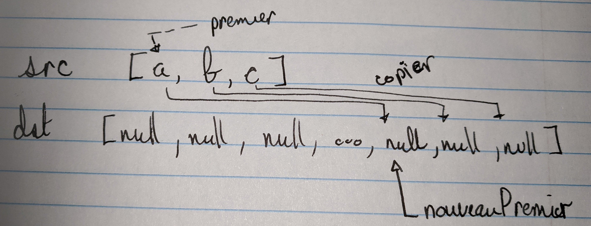
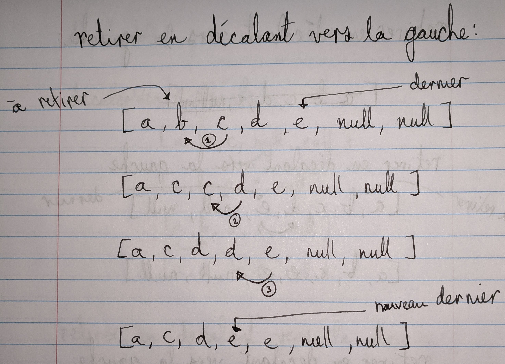

# Module 5.1: Liste avec tableau

<video width="50%" src="01.mp4" type="video/mp4" controls>

 

IMPORTANT: pour réussir ce module, vous <strong>devez</strong>:
<ul>
<li>dessiner par vous-même des exemples de listes et de tableaux
<li>suivre la théorie et le code en modifiant ou annotant vos exemples
<li>par exemple:
</ul>

 
 

1. $[link ./theorie/](Théorie)
1. <a href="https://cmontmorency.moodle.decclic.qc.ca/mod/quiz/view.php?id=220433" target="_blank">Mini-test sur la théorie</a>
1. $[link ./tutoriel/](Tutoriel)
1. $[link ./atelier/](Atelier)
1. <a href="https://cmontmorency.moodle.decclic.qc.ca/mod/quiz/view.php?id=220434" target="_blank">Mini-test sur l'atelier</a>

<!--

1. <a href="https://cmontmorency.moodle.decclic.qc.ca/mod/quiz/view.php?id=220436" target="_blank">Question d'entrevue</a>
    * **IMPORTANT**: je fais cette question **devant le prof**
-->

 

RAPPEL: toutes les évaluations sont <strong>individuelles</strong> 
<ul>
<li>chaque remise est analysée par un outil de détection de plagiat
<li><strong>aucune</strong> collaboration permise pour un mini-test ou une question d'entrevue
<li>ne <strong>jamais</strong> copier-coller le code d'un autre étudiant
<li>ne <strong>jamais</strong> écrire directement le code qu'un autre étudiant vous dicte
</ul> 

