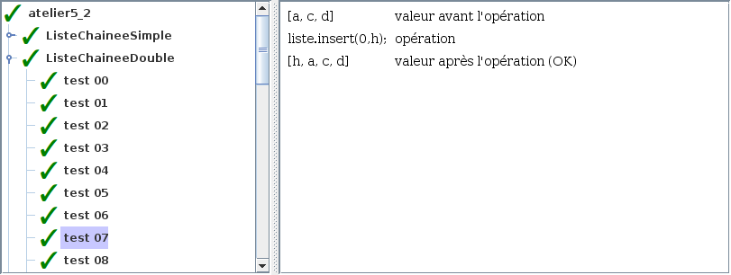
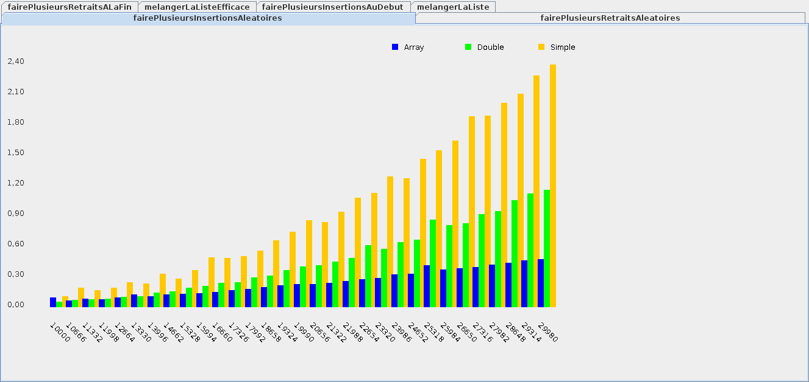

# Atelier 5.2: liste chaînée double

## Préalable

1. J'effectue d'abord le $[link ../tutoriel/](tutoriel 5.2)

## Objectifs

1. En utilisant Eclipse, je crée un nouveau projet Java
    * Le projet doit **obligatoirement** être comme suit:
        * nom du projet: `atelier5_2`
        * chemin du projet: `~/3c6_PRENOM_NOM/atelier5_2`
        * le projet doit utiliser le **JDK 1.8**
        * le projet utilise la librairie $[download ./atelier5_2.jar](atelier5_2.jar)

1. À partir de l'$[link ../../01/atelier/](atelier 5.1) et du $[link ../tutoriel/](tutoriel 5.2), je recopie les classes:
    * `ListeJavaArray`
    * `TesteurDeListeAbstrait`
    * `TesteurDeListeArray`
    * `TesteurDeListeChaineeSimple`
    * `ListeJavaChaineeSimple`
    * `ElementChaineSimple`

1. Je crée la classe `ElementChaineDouble` 

1. Je crée la classe `ListeJavaChaineeDouble` qui hérite de la classe `ListeJava`

1. En suivant la théorie, j'implante les méthodes pour remplir le contrat de `ListeJava`
    * l'élément doit mémoriser deux pointeurs: suivant et précédent
    * il faut mémoriser la taille de la liste
    * il faut mémoriser la tête de la liste
    * il faut chercher un élément vers l'avant OU vers l'arrière
      
    

    ATTENTION: les listes de taille 0 <strong>ET</strong> 1 sont des cas spéciaux, p.ex:
    <ul>
    <li>sur `add('a')`:
        <ul>
            <li>il faut créer la tête si elle n'existe pas
            <li>les pointeurs <code>suivant/precedent</code> à placer avec soin
        </ul>
    <li>sur `remove(0)`: il faut mémoriser une nouvelle tête
    </ul>
    

     
     

1. Je crée la classe `TesteurDeListeChaineeDouble`

1. Je crée la classe `MonAtelier5_2` qui hérite de la classe `Atelier5_2`

1. Je corrige les erreurs de compilation

1. J'ajoute une méthode `main` à la classe `MonAtelier5_2`:

    $[java ./MonAtelier5_2 3 6]()

1. J'implante les méthodes pour remplir le contrat du `Atelier5_2`, p.ex:

    $[java ./MonAtelier5_2 8 36]()

1. J'exécute mon projet, je valide mon code et vérifie la performance:

    

        
    

    

        
    

1. J'ajoute les fichiers du projet dans Git 

1. Je fais un `commit` et un `push`

## Remise

1. Je pousse un commit avec **exactement** le commentaire `atelier 5.2`, p.ex:

        $ git commit --allow-empty -m"atelier 5.2"
        $ git push

<!--

1. Je peux faire l'entrevue avant la date limite en créant un billet `entrevue 5.2`
    * Le prof va prioriser les questions, je devrai peut-être faire preuve de patience

1. Sinon, le prof va me contacter avec un rendez-vous avant la date limite

-->
