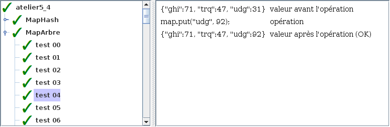

# Atelier 5.4: map avec arbre

## Préalable

1. J'effectue d'abord le $[link ../tutoriel/](tutoriel 5.4)

## Objectifs

1. En utilisant Eclipse, je crée un nouveau projet Java
    * Le projet doit **obligatoirement** être comme suit:
        * nom du projet: `atelier5_4`
        * chemin du projet: `~/3c6_PRENOM_NOM/atelier5_4`
        * le projet doit utiliser le **JDK 1.8**
        * le projet utilise la librairie $[download ./atelier5_4.jar](atelier5_4.jar)

1. À partir de l'$[link ../../03/atelier/](atelier 5.3), je recopie les classes:
    * `ChaineHashc`
    * `JavaMapNaif`
    * `JavaMapHash`
    * `TesteurDeMapAbstrait`
    * `TesteurDeMapHashc`

1. À partir du $[link ../tutoriel/](tutoriel 5.4), je recopie les classes:
    * `MonNoeud`
    * `MonArbre`

1. Je crée la classe `ChaineComparable` avec la signature suivante:

    $[java ./ChaineComparable 1 1]()

1. Je crée la classe `MaPairePourMap` avec la signature suivante:

    $[java ./MaPairePourMap 1 2]()

1. Je crée la classe `MapJavaArbre` avec la signature et l'attribut suivants:

    $[java ./MapJavaArbre 1 4]()

    * NOTE: l'arbre est une arbre où chaque noeud est une paire

1. En suivant la théorie, j'implante les méthodes pour remplir le contrat de `MapJava`

1. Je crée la classe `TesteurDeMapArbre` qui hérite de `TesteurDeMapAbstrait`

1. Je crée la classe `MonAtelier5_4` qui hérite de la classe `Atelier5_4`

1. Je corrige les erreurs de compilation

1. J'ajoute une méthode `main` à la classe `MonAtelier5_4`:

    $[java ./MonAtelier5_4 3 6]()

1. J'implante les méthodes pour remplir le contrat du `Atelier5_4`, p.ex:

    $[java ./MonAtelier5_4 8 36]()

1. J'exécute mon projet, je valide mon code et vérifie la performance:

    

        
    

    

        
    

1. J'ajoute les fichiers du projet dans Git 

1. Je fais un `commit` et un `push`

## Remise

1. Je pousse un commit avec **exactement** le commentaire `atelier 5.4`, p.ex:

        $ git commit --allow-empty -m"atelier 5.4"
        $ git push

<!--

1. Je peux faire l'entrevue avant la date limite en créant un billet `entrevue 5.4`
    * Le prof va prioriser les questions, je devrai peut-être faire preuve de patience

1. Sinon, le prof va me contacter avec un rendez-vous avant la date limite

-->
