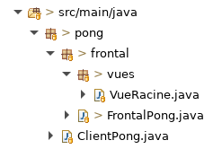
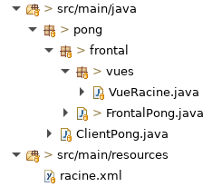
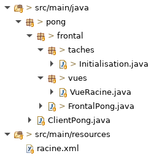
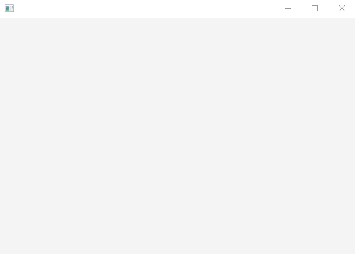

# Tutoriel 3.1: créer et installer la `VueRacine`

## Créer la classe `VueRacine`

1. En Eclipse, je crée le paquet `pong.frontal.vues`

1. Dans le paquet `vues`, je crée la classe `VueRacine`

1. J'ajuste la signature de la classe, qui doit hériter de `ViewFx`:

    $[java ./VueRacine 1 1]()

1. Avec $[kbd](Ctrl+1), j'ajoute les `import` et la méthode obligatoire:

    $[java ./VueRacine]()

    * NOTES: 
        * la méthode `initialize` est requise par JavaFx.  
        * on va s'en servir au module 4

1. Je m'assure d'avoir l'arborescence suivante dans mon projet:

## Créer le fichier `.xml`

1. Dans le répertoire `pong/src/main/resources/`, je créer le fichier `racine.xml`

1. Pour commencer, j'ajoute le code suivant dans ce fichier:

    $[xml ./racine]()

    * NOTES: 
        * l'attribut `fx:controller` déclare notre classe `VueRacine`
        * JavaFx utilise le terme `controller`, mais en `Ntro` on dirait Vue

1. Je m'assure d'avoir l'arborescence suivante dans mon projet:

## Déclarer la Vue dans le Frontal

1. J'ouvre `FrontalPong.java` et je déclare la `VueRacine`

    $[java ./FrontalPong01]

## Organiser les tâches

1. Je crée le paquet `pong.frontal.taches`

1. Dans le paquet `taches`, je crée la classe `Initialisation.java`

1. Dans cette classe, je vais mettre toutes les tâches d'initialisation

1. Pour organiser le code, je vais créé une méthode pour chaque tâche

1. J'ouvre `Initialisation.java` et je copie le `import static` des tâches:

    *  `import static ca.ntro.app.tasks.frontend.FrontendTasks.*;` 

1. Ensuite, je crée la méthode `afficherFenetre`

    $[java ./Initialisation 1 14]

    * J'utilise $[kbd](Ctrl+1) pour ajouter les `import` requis

1. En haut de la classe `Initialisation`, je crée la méthode `creerTaches`

    $[java ./Initialisation 49 53]

    * NOTES:
       * je vais appeler ici chaque méthode qui crée une tâche d'initialisation

1. Je m'assure d'avoir l'arborescence suivante dans mon projet:

## Créer les tâches pour charger la Vue

1. Dans la classe `Initialisation`, je crée les méthodes suivantes

    $[java ./Initialisation 16 47]

    * J'utilise $[kbd](Ctrl+1) pour ajouter les `import` requis

1. Dans `Initialisation.creerTaches`, j'ajoute les bons appels

    $[java ./Initialisation 55 61]

1. Dans `FrontalPong`, je vais maintenant appeler `Initialisation.creerTaches`

    $[java ./FrontalPong02]

## Vérifier que la Vue s'affiche

1. J'exécute `pong`

        $ cd tutoriels
        $ sh gradlew client

1. Je vérifie qu'une fenêtre grise s'affiche

    

        
    

    * Il y a un problème si:
        * le texte `[NtroAppFx default view]` s'affiche toujours
        * la fenêtre est transparente ou boguée

## Vérifier le graphe de tâches

1. J'exécute le client `pong`

        $ cd tutoriels
        $ sh gradlew client

1. Je vérifie mon graphe de tâches `pong/_storage/graphs/frontend.png`

    

