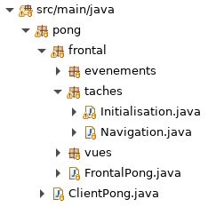
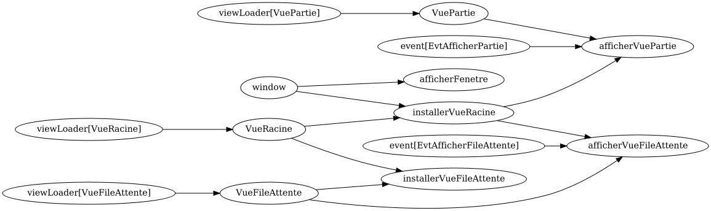
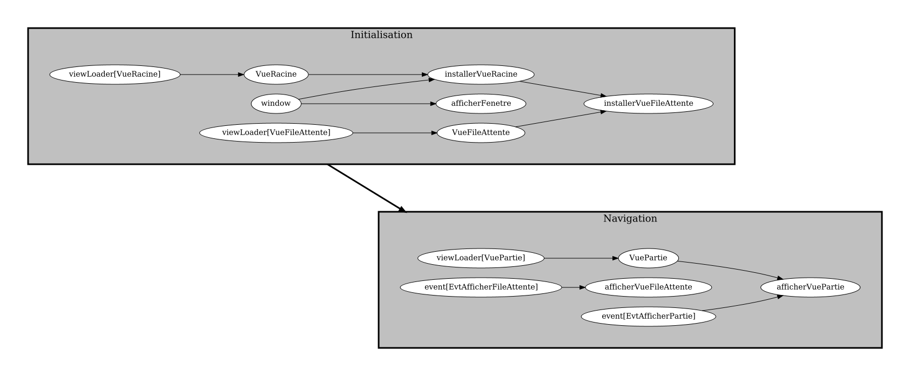
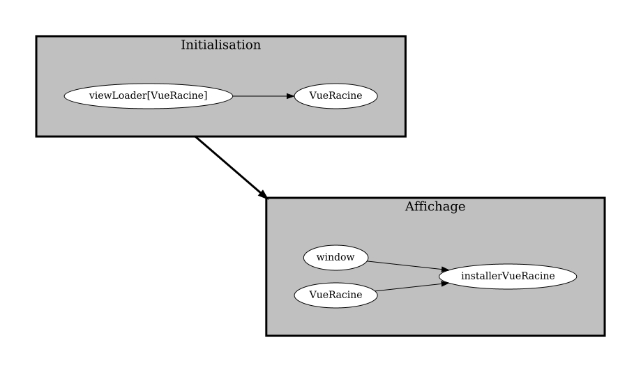

# Graphe de tâche hiérarchique

## Organiser les tâches

<video width="50%" src="organiser.mp4" type="video/mp4" controls>

* On peut organiser les tâches en deux catégories:
    * `Initialisation`
    * `Navigation`

* Comme arborescence, on a

    

        
    

* Dans `FrontalPong`, on a

    $[java ./FrontalPong]()

* Dans `Initialisation`, on a les tâches suivantes:

    $[java ./Initialisation01]()

    * où chaque méthode va créer une tâche
        

* Dans `Navigation`, on a les tâches suivantes:

    $[java ./Navigation01]()

    * où chaque méthode va créer une tâche

## Problème: le graphe des tâches devient difficile à lire

<video width="50%" src="probleme.mp4" type="video/mp4" controls>

    

## Solution: rassembler les tâches en groupes

<video width="50%" src="solution.mp4" type="video/mp4" controls>

    

* Le groupe `Initialisation` va s'exécuter **au complet** avant le groupe `Navgation`

* Les résultats du groupe `Initialisation` sont disponibles pour le groupe `Navigation`

## Graphe de tâches hiérarchique en Java

<video width="50%" src="creer_graphe_hierarchique.mp4" type="video/mp4" controls>

* On garde la même arborescence

    

        
    

* Dans `FrontalPong`, on a la même chose:

    $[java ./FrontalPong]()

* Dans `Initialisation`, on va créer un groupe de tâches

    $[java ./Initialisation02]()

    * **ATTENTION** appeler chaque méthode avec `subTasks` 

* Dans `Navigation`, on va créer un groupe de tâches

    $[java ./Navigation02]()

    * le `waitsFor("Initialisation")` permet de déclarer que
        * `Navigation` s'exécute après qu'`Initialisation` ait terminé au complet

* **IMPORTANT** dans `Navigation`, les résultats d'`Initialisation` sont disponibles

* Par exemple, pour la tâche `afficherVuePartie`

    $[java ./afficherVuePartie]()

    * il ne faut pas ajouter un `waitsFor(created(VueRacine))`
    * ce résultat est disponible *sans le demander*, puisque:
        * il s'agit d'un résultat du groupe `Initialisation`
        * le groupe `Navigation` s'exécute toujours après le groupe `Initialisation`

## Graph de tâches: éviter dépendances cycliques

<video width="50%" src="dependances_cycliques.mp4" type="video/mp4" controls>

* Qu'est-ce qui se passe si on écrit la tâche suivante?

    $[java ./Cycle01]()

* Dans le graphe, on voit qu'on a créé une dépendance cyclique

    

        
    

    * avant d'exécuter `VueRacine`, il faut terminer `VueRacine`... oups!

* Comme c'est impossible à exécuter, `Ntro` va donner un message d'erreur

        [FATAL] cyclic dependancy for task VueRacine
            Please correct graph.

* Avec les groupes de tâches, il faut éviter de répéter un `waitsFor` déjà disponible

    

        
    

    * dans `Affichage`, on répète un `waitsFor` à `VueRacine`
    * ce n'est pas nécessaire, `VueRacine` est déjà disponible via `Initialiation`
    * en plus on crée a une dépendance cyclique dans `Affichage`
        * avant d'exécuter `installerVueRacine`, il faut terminer `VueRacine`
        * avant d'exécuter `VueRacine`, il faut terminer `Initialisation`
        * pour terminer `Initilisation`, il faut exécuter `VueRacine`... oups!

* Encore une fois, on aurait l'erreur

        [FATAL] cyclic dependancy for task VueRacine
            Please correct graph.

