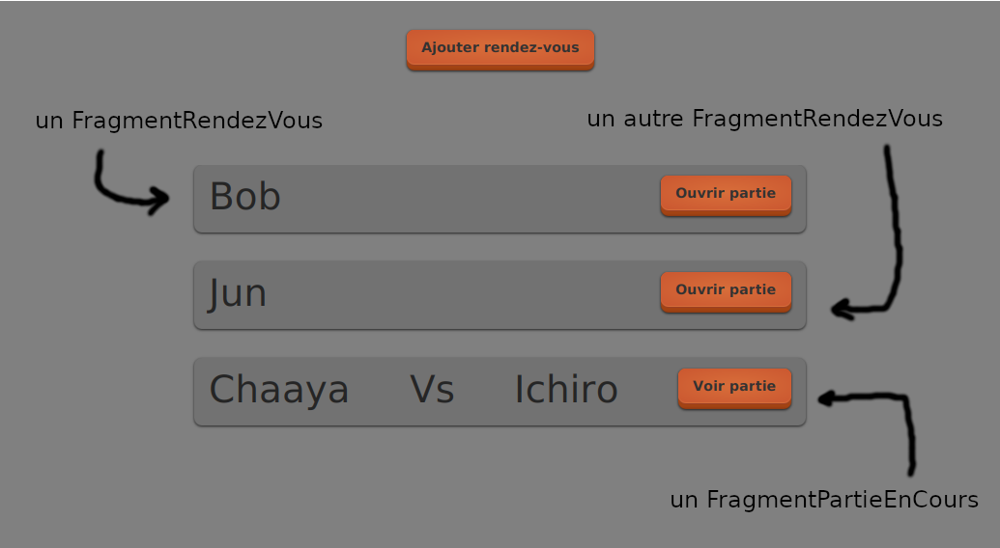

# Théorie: notion de fragment

## Qu'est-ce que fragment de vue?

<video width="50%" src="fragment.mp4" type="video/mp4" controls>

* Un fragment est une Vue qui affiche un élément plutôt que la page au complet
    * p.ex. `FragmentRendezVous` va afficher un rendez-vous dans la page file d'attente

    

* Le fragment s'insère dans une autre Vue

* Aussi appelé:
    * Vue partielle (un `partial`)
    * Sous-vue

## Un fragment en `Ntro`

<video width="50%" src="fragment_ntro.mp4" type="video/mp4" controls>

* `Ntro` n'a pas de notion officielle de fragment

* Par convention, on va:
    * appeler la classe `FragmentRendezVous` plutôt que `VueRendezVous`
    * placer le `.xml` dans le répertoire `resources/fragments`

* On va utilisé la même méthodologie que pour une Vue:

    $[java ./methodologie]()
