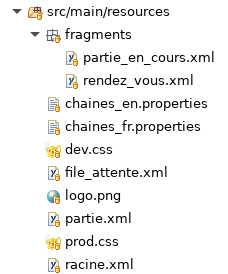
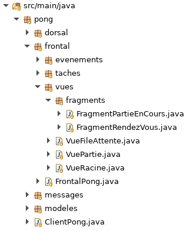

# Tutoriel 8.2: créer `FragmentRendezVous` et `FragmentPartieEnCours`

## Créer les fichiers `.xml`

1. Dans `pong/src/main/resources`, j'ajoute le sous-répertoire `fragments`

1. Dans le répertoires `fragments`, je crée les fichiers 
    * `rendez_vous.xml`
    * `partie_en_cours.xml`

1. En Eclipse, je m'assure d'avoir l'arborescence suivante:

    

        
    

1. J'ouvre `rendez_vous.xml` et j'ajoute le code suivant:

    $[xml ./rendez_vous]()

    * NOTE: je peux télécharger $[download ./rendez_vous.xml](ce fichier)

1. J'ouvre `partie_en_cours.xml` et j'ajoute le code suivant:

    $[xml ./partie_en_cours]()

    * NOTES: 
        * je peux télécharger $[download ./partie_en_cours.xml](ce fichier)
        * il n'y a pas de notion d'héritage pour le `.xml`
        * on doit alors recopier des portions de `rendez_vous` 

        

## Ajouter le CSS

1. J'ajoute le CSS suivant à `dev.css` et `prod.css`

    $[css ./dev01]()

    * NOTE: je peux télécharger $[download ./dev01.css](cet extrait)

## Ajouter les traductions

1. J'ouvre `chaines_fr.properties` et j'ajoute la valeur suivante:

    <pre>
    voirPartie=Voir partie
    </pre>

1. J'ouvre `chaines_en.properties` et j'ajoute la valeur suivante:

    <pre>
    voirPartie=Spectate
    </pre>

## Créer les classes

1. En Eclipse, je crée le paquet `pong.vues.fragments`

1. Dans `fragments`, je crée les classes:
    * `FragmentRendezVous`
    * `FragmentPartieEnCours`

1. En Eclipse, je m'assure d'avoir l'arborescence suivante:

    

        
    

1. J'ouvre `FragmentRendezVous` et j'ajoute ce code

    $[java ./FragmentRendezVous]()

1. J'ouvre `FragmentPartieEnCours` et j'ajoute ce code

    $[java ./FragmentPartieEnCours]()

    * NOTES:
        * ici on peut utiliser l'héritage pour réutiliser `FragmentRendezVous`

## Déclarer les fragments

1. Dans `FrontalPong`, je déclare les fragments comme des vues

    $[java ./FrontalPong]()

    * NOTES:
        * attention au répertoire `/fragments`
