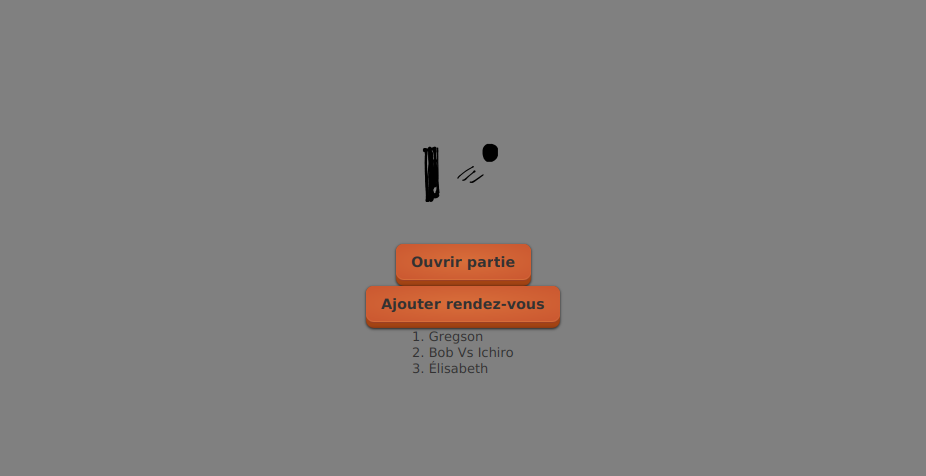
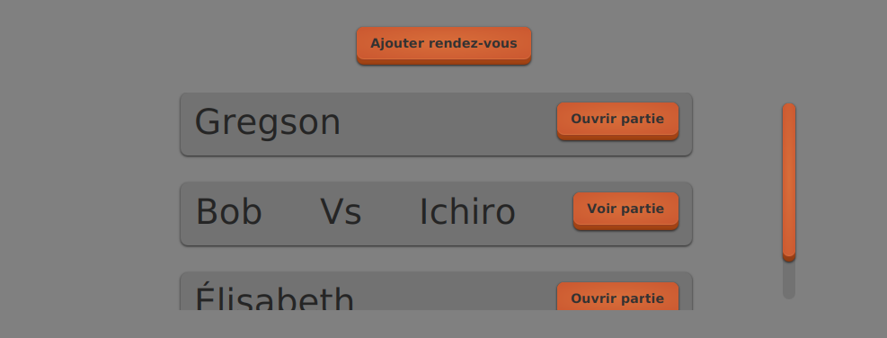

# Tutoriel 8: améliorer les vues

<strong>IMPORTANT</strong>

<ul>
<li>Je m'assure d'avoir terminé le tutoriel 7 avant de commencer
<li>Je m'assure de migrer à la version <code>0.8</code> de <code>Ntro</code>
</ul>

### Préalables

* $[link ./version/](Migrer vers la version `0.8` de `Ntro`)

### Objectif

* Afficher les rendez-vous avec des éléments graphiques plutôt que du texte

* Transformer ça:

* En ça:

* NOTE: c'est les mêmes données

### Étapes

1. $[link ./conteneur_rendez_vous/](Ajouter le `conteneurRendezVous` à la `VueFileAttente`)

1. $[link ./fragments/](Créer les fragments `FragmentRendezVous` et `FragmentPartieEnCours`)

1. $[link ./utiliser_les_fragments/](Dans le frontal, charger et utiliser les fragments)

1. $[link ./afficher_rendez_vous/](Afficher chaque rendez-vous avec un fragment)

1. $[link ./tailles_elastiques/](Utiliser des tailles elastiques)

1. $[link ./flexbox/](Créer et utiliser le contrôle `FlexBoxRendezVous`)

1. $[link ./defilement/](Ajouter une barre de défilement)

1. (OPTIONNEL) $[link ./canvas_partie/](Créer et utiliser le contrôle `CanvasPartie`)

