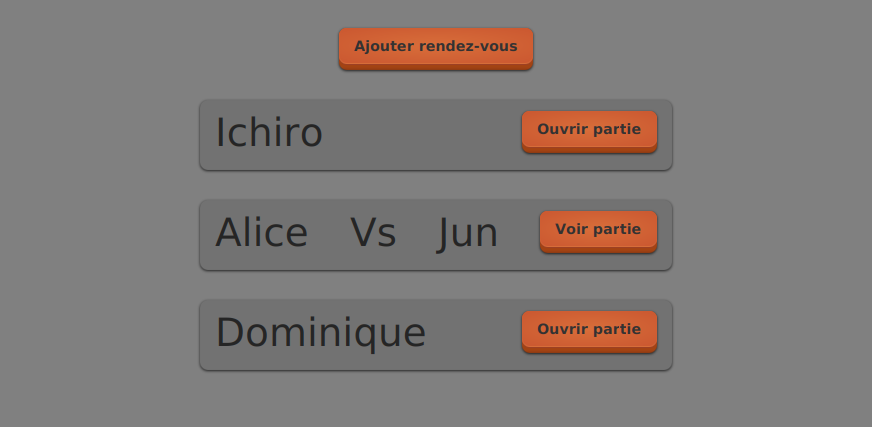

# Tutoriel 8.5: utiliser des tailles élastiques

## Ajouter les tailles élastiques

1. J'ouvre `file_attente.xml` et j'ajoute les `VBox.vgrow` et les `HBox.hgrow`

    $[xml ./file_attente]()

1. J'ouvre `rendez_vous.xml` et j'ajoute les `HBox.hgrow`

    $[xml ./rendez_vous]()

1. J'ouvre `partie_en_cours.xml` et j'ajoute les `HBox.hgrow`

    $[xml ./partie_en_cours]()

## Vérifier l'effet

1. J'exécute le client et je vérifie l'effet des tailles élastiques

        $ cd tutoriels
        $ sh gradlew client

    

        
    

