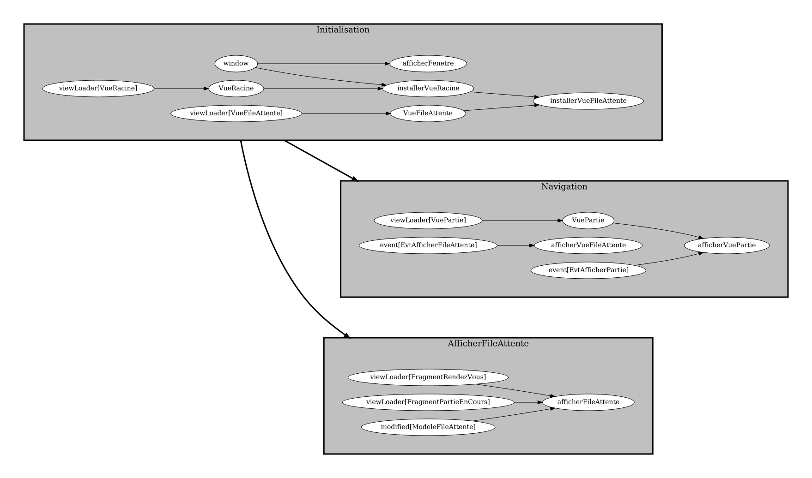
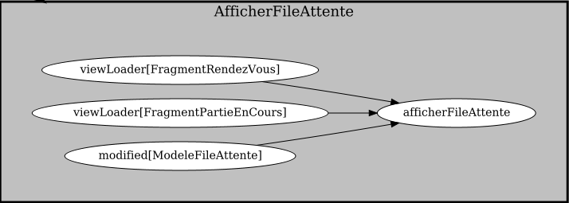

# Tutoriel 8.3: charger les fragments

## Charger les fragments

1. J'ouvre `AfficherFileAttente`

1. Dans la tâche `afficherFileAttente`, j'ajoute des `waitsFor` pour les fragments

    $[java ./AfficherFileAttente01]()

1. Je peux ensuite récupérer les `viewLoader` des fragments dans la tâche

    $[java ./AfficherFileAttente02]()

1. J'exécute et je véririe mon graphe des tâches pour le frontal
    * en particulier le groupe de tâche `AfficherFileAttente`

            $ cd tutoriels
            $ sh gradlew client

    

        
    

    

        
    

    * NOTES:
        * on voit qu'on charger les fragments avant d'afficher

## Modifier `afficherSur` pour supporter les fragments

1. J'ouvre `ModeleFileAttente` et je modifie la signature de `afficherSur`

    $[java ./ModeleFileAttente01]()

## Appeler la nouvelle version de `afficherSur`

1. De retour à la tâche `afficherFileAttente`, j'appelle la nouvelle version de `afficherSur`

    $[java ./AfficherFileAttente03]()

    * NOTES:
        * on passe les `ViewLoader` à la méthode qui affiche le modèle
        * cette méthode pourra créer un nouveau fragment pour chaque rendez-vous à afficher
