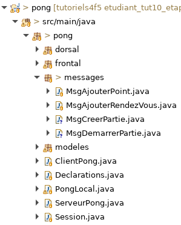

# Tutoriel 10.4: créer et démarrer une partie

## Ajouter des messages

1. Dans `message`, je crée la classe `MsgCreerPartie`

1. Dans `message`, je crée la classe `MsgDemarrerPartie`

1. En Eclipse, je m'assure d'avoir l'arborescence suivante

    

        
    

### Coder `MsgCreerPartie`

1. J'ouvre `MsgCreerPartie` et j'ajuste la signature

    $[java ./MsgCreerPartie01 1 1]()

1. J'utilise $[kbd](Ctrl+1) pour corriger les erreurs

1. Je complète le code de `MsgCreerPartie`

    $[java ./MsgCreerPartie01]()

1. Avec $[kbd](Shift+Alt+S), je crée les méthodes *get/set*

1. Avec $[kbd](Ctrl+1), je crée la méthode `ModeleFileAttente.creerPartie`

### Coder `MsgDemarrerPartie`

1. J'ouvre `MsgDemarrerPartie` et j'ajuste la signature

    $[java ./MsgDemarrerPartie01 1 1]()

1. J'utilise $[kbd](Ctrl+1) pour corriger les erreurs

1. Je complète le code de `MsgDemarrerPartie`

    $[java ./MsgDemarrerPartie01]()

1. Avec $[kbd](Shift+Alt+S), je crée les méthodes *get/set*

1. Avec $[kbd](Ctrl+1), je crée la méthode `ModelePartie.demarrer`

### Déclarer les messages

1. J'ouvre `Declarations` et je déclare les messages

    $[java ./Declarations01]()

## Identifier chaque rendez-vous dans la Vue

1. Dans `FragmentRendezVous`, j'ajoute le code suivant

    $[java ./FragmentRendezVous01]()

1. Dans la valeur `RendezVous`, j'ajoute le code suivant

    $[java ./RendezVous01]()

## Envoyer `MsgCreerPartie` du frontal vers le dorsal

1. Dans `FragmentRendezVous`, j'utilise $[kbd](Shift+Alt+R) pour renommer la méthode
    * était: `installerEvtAfficherPartie` 
    * devient: `installerMsgCreerPartieEtEvtAfficherPartie`

1. Dans la méthode `installerMsgCreerPartieEtEvtAfficherPartie`,
    * j'utilise $[kbd](Shift+Alt+R) pour renommer la variable 
        * était: `evtNtro` 
        * devient: `evtAfficherPartie`

1. J'ajoute le code suivant

    $[java ./FragmentRendezVous02]()

    * NOTES
        * utiliser $[kbd](Ctrl+1) pour créer la méthode `envoyerMsgCreerPartie`

## Ne pas envoyer un `MsgCreerPartie` en mode spectacteur

1. J'ouvre `FragmentPartieEnCours` et j'ajoute le code suivant

    $[java ./FragmentPartieEnCours01]()

## Recevoir `MsgCreerPartie` dans le dorsal

1. J'ouvre `ModifierFileAttente` et j'ajoute le code suivant

    $[java ./ModifierFileAttente01]()

1. J'ouvre `ModeleFileAttente` et j'ajoute le code suivant

    $[java ./ModeleFileAttente02]()

1. J'utilise $[kbd](Ctrl+1) pour créer la méthode `RendezVous.siIdEst`

1. Dans `RendezVous`, je complète le code 

    $[java ./RendezVous02]()
    
1. Je reviens à `ModeleFileAttente` et je complète la méthode `creerPartie`

    $[java ./ModeleFileAttente03]()

1. J'utilise $[kbd](Ctrl+1) pour créer la méthode `RendezVous.creerPartieEnCours`

1. Dans `RendeVous`, je complète le code

    $[java ./RendezVous03]()

1. Je reviens à `ModeleFileAttente`

1. J'utilise $[kbd](Ctrl+1) pour créer la méthode `PartieEnCours.creerMessageDemarrerPartie`

1. Dans `PartieEnCours`, je complète le code

    $[java ./PartieEnCours01]()

## Envoyer `MsgDemarrerPartie` du dorsal vers le dorsal

1. Dans `ModifierFileAttente`, j'ajoute l'envoi du `msgDemarrerPartie`

    $[java ./ModifierFileAttente02]()

## Vérifier l'ajout d'un fragment `PartieEnCours`

1. Dans **3 GitBash différents**, j'exécute

        $ sh gradlew serveur
        $ sh gradlew alice
        $ sh gradlew bob

    

     <video width="100%" src="partie_en_cours01.mp4" type="video/mp4" loop nocontrols autoplay>
    

    * NOTES
        * pour l'instant, la partie de s'ouvre pas pour Alice (écran du haut)

## Recevoir `MsgDemarrerPartie` dans le dorsal

1. J'ouvre `ModifierPartie` et j'ajoute ce code

    $[java ./ModifierPartie01]()

1. J'ouvre `ModelePartie` et je complète la méthode `demarrer`

    $[java ./ModelePartie01]()

1. J'utilise $[kbd](Ctrl+1) pour créer la méthode `MondePong2d.demarrerPartie`

1. Dans `MondePong2d`, je complète le code

    $[java ./MondePong2d01]()

1. J'utilise $[kbd](Ctrl+1) pour soit:
    * créer la méthode `Balle2d.choisirEtatInitial`
    * changer la visibilité de la méthode `choisirEtatInitial` 

1. Dans `Balle2d`, je complète le code au besoin

    $[java ./Balle2d01]()

1. (OPTIONNEL) J'ajoute le code suivant pour les palettes

    $[java ./MondePong2d02]()

    $[java ./Palette2d01]()

## Diffuser `MsgDemarrerPartie` du serveur vers les clients

1. J'ouvre `ModifierPartie` et j'ajoute ce code

    $[java ./ModifierPartie02]()

## Recevoir `MsgDemarrerPartie` dans le frontal

1. J'ouvre `Navigation` et j'ajoute

    $[java ./Navigation01]()

## Vérifier que la partie démarre automatiquement

1. Dans **4 GitBash différents**, j'exécute

        $ sh gradlew serveur
        $ sh gradlew alice
        $ sh gradlew bob
        $ sh gradlew charlie

    

     <video width="100%" src="partie_en_cours02.mp4" type="video/mp4" loop nocontrols autoplay>
    

    * NOTES
        * la partie démarre automatiquement pour Alice et Bob
        * la partie ne démarre pas pour Charlie, puisqu'il est spectateur
        * le client de Charlie reçoit le message, mais l'ignore
