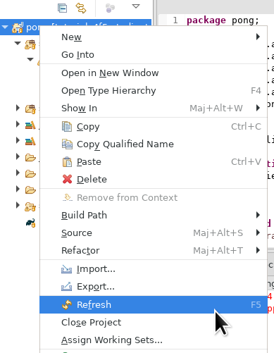
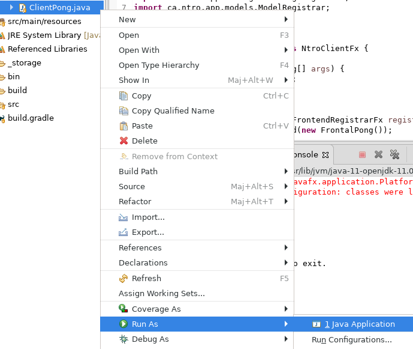
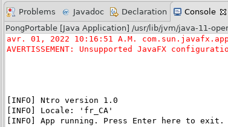

# Tutoriel 10.1: migrer à la version `1.0` de `Ntro`

1. Dans le répertoire `tutoriels`, j'ouvre `gradle.properties`

1. Je modifie `ntroVersion` pour indiquer `1.0`

    Était:

    <pre>
        ntroVersion=0.9
    </pre>

    Devient:

    <pre>
        ntroVersion=1.0
    </pre>

1. Je modifie `ntroDependancies` pour ajouter `server,server_jdk`

    Était:

    <pre>
        ntroDependancies=core,core_jdk,app,app_jdk,app_fx
    </pre>

    Devient:

    <pre>
        ntroDependancies=core,core_jdk,app,app_jdk,app_fx,server,server_jdk
    </pre>

1. En Gradle, j'exécute le client `pong`

        $ cd tutoriels
        $ sh gradlew client

            # Gradle va télécharger la version 1.0 de Ntro

            # Devrait afficher la fenêtre principale
            # Devrait afficher à la console

            [INFO] Ntro version 1.0

1. En Gradle, je recrée le projet Eclipse

        $ sh gradlew eclipse

1. En Eclipse, je rafraîchis le projet `pong`

    * Clique-droit sur le projet => *Refresh*

        

            
        

1. En Eclipse, j'exécute le client `pong`
    * Clique-droit `ClientPong` => *Run as* => *Java Application*

        

            
        

    * Devrait aussi afficher `[INFO] Ntro version 1.0`

        

            
        

1. En cas d'erreurs bizarres avec Eclipse
    * je m'assure que j'ai la version `0.8` dans `tutoriels/gradle.properties`
    * je refais les étapes de cette page
    * si j'ai encore des erreurs, je suis cette <a href="/cegep/420-4F5-MO/procedures/eclipse">procédure</a>
