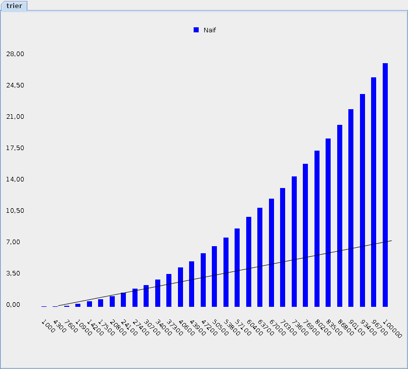
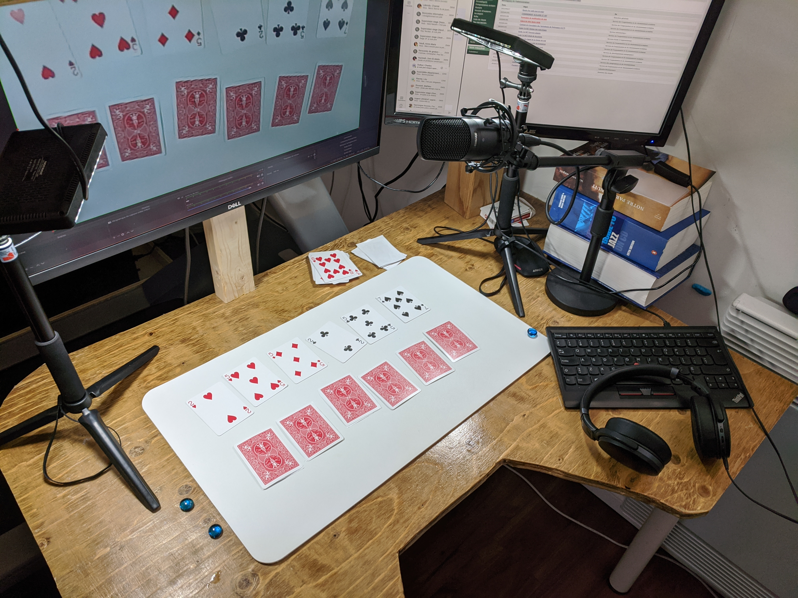

# Les structures de données expliquées avec des cartes

* 6 vidéos
* temps total: 20 minutes
* brouillon du manuel sur <a href="http://codelescartes.ca">codelescartes.ca</a>

## Intro

<video width="50%" src="intro.mp4" type="video/mp4" controls>

## Le tri

<video width="50%" src="intro_tri.mp4" type="video/mp4" controls>

## Le tri «humain»

<video width="50%" src="tri_humain.mp4" type="video/mp4" controls>

#### tri «humain» à l'écran

<video width="80%" src="tri_humain_a_l_ecran.mp4" type="video/mp4" loop nocontrols autoplay></video>

#### tri «humain» en code JSON

<video width="80%" src="tri_humain_en_json.mp4" type="video/mp4" loop nocontrols autoplay></video>

#### tri «humain» avec des données en Java

<video width="50%" src="tri_humain_donnees_java.mp4" type="video/mp4" loop nocontrols autoplay></video>

## Le tri en programmation

<video width="50%" src="tri_naif.mp4" type="video/mp4" controls>

#### tri en programmation à l'écran 

* 6 cartes:

<video width="50%" src="tri_naif_6_cartes.mp4" type="video/mp4" controls>

* 20 cartes:

<video width="50%" src="tri_naif_20_cartes.mp4" type="video/mp4" controls>

## Efficacité

<video width="50%" src="tri_naif_efficacite.mp4" type="video/mp4" controls>

 
 
 
 

#### Efficace Vs inefficace en théorie

* nombre d'opérations simples selon le nombre d'éléments en entrée

    

    
    

#### Efficace Vs inefficace mesuré

* temps d'exécution selon le nombre d'éléments en entrée

## Un tri efficace

<video width="50%" src="tri_fusion.mp4" type="video/mp4" controls>

* L'efficacité du tri fusion est `O(log(n)·n)` 

* Les algorithmes `O(log(n)·n)` sont presques aussi efficaces que `O(n)`:

    

 
 
 
 
 

# NOTES

## Installation temporaire

* J'ai dû tourner avec ma Webcam, d'où la piètre qualité d'image (et l'effet branlant)
* Le Collège Montmorency possède une «caméra document» que je pourrai utiliser pour d'éventuelles vidéos finales

## Vidéos Youtube

* Habituellement j'intègre les vidéos directement à la page, mais elle n'affichaient pas dans tous les navigateurs (?), alors j'ai préféré Youtube pour cette fois.
