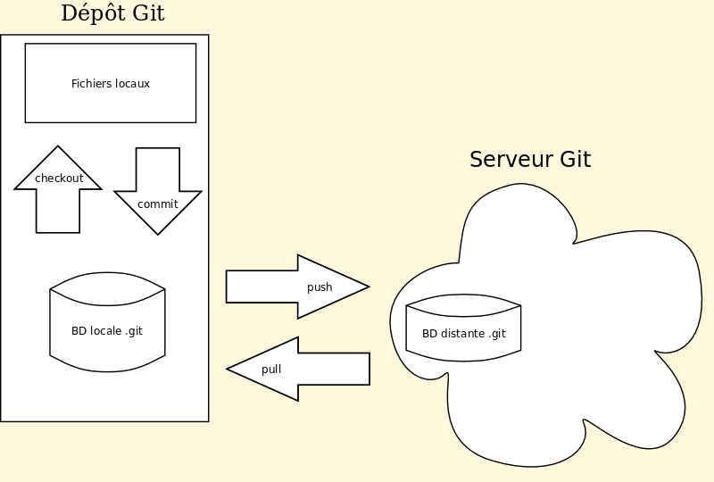
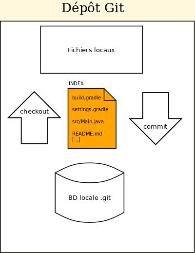

# Introduction à Git

## Utilité de l'outil

<video width="50%" src="git01.mp4" type="video/mp4" controls>

1. Conserve un historique de vos modifications et permet de revenir en arrière
1. Permet de sauvegarder votre code sur un serveur 
1. Permet de collaborer en fusionnant automatiquement des versions différentes

## Terminologie

<video width="50%" src="git02.mp4" type="video/mp4" controls>

* **dépôt**: base de données de versions (*repository*)
* **commit**: enregistrement d'une version du projet
* **annuler**: revenir en arrière à un ancien commit (*revert*)
* **pousser**: copier les commits récents sur le serveur (*push*)
* **tirer**: obtenir du serveur les commits récents (*pull*)

## Espaces gérés par Git

<video width="50%" src="git03.mp4" type="video/mp4" controls>

* **fichiers locaux**: les fichiers normaux sur votre disque (*working tree*)
* **BD locale**: la base de données des commits (répertoire `.git`)
* **BD distante**: le serveur où sauvegarder (*remote*)

### Exemples

1. Quels fichiers locaux diffèrent du commit le plus récent de la BD?:

        $ git status -u

1. Quelles lignes des fichiers locaux diffèrent du commit le plus récent de la BD?:

        $ git diff

1. Enregistrer les modifications locales dans la DB:

        $ git commit -a

1. Ajouter un serveur où sauvegarder

        $ git remote add NOM_SERVEUR USAGER@SERVEUR:DÉPÔT

    * par convention le serveur par défaut s'appelle `origin`

1. Sauvegarder les derniers commit sur le serveur:

        $ git push

   *  un changement non-commité n'est **pas** envoyé sur le serveur

## Fichiers suivis Vs non-suivis

<video width="50%" src="git04.mp4" type="video/mp4" controls>

* Git gère seulement les fichiers suivis (contenu dans un index)
* Les fichiers non-suivis ne sont **jamais** modifiés par Git
* Le `.gitignore` indique les fichiers qu'on ne veut *jamais* suivre:
    * fichiers temporaires, gros fichiers, paramètres locaux, etc.

### Exemples

1. Suivre un fichier:

        $ git add FICHIER

1. Suivre tous les fichiers du répertoire courant:

        $ git add .

1. Arrêter de suivre un fichier (sans l'effacer):

        $ git rm --cached FICHIER

1. Arrêter de suivre un fichier (et l'effacer):

        $ git rm -f FICHIER
